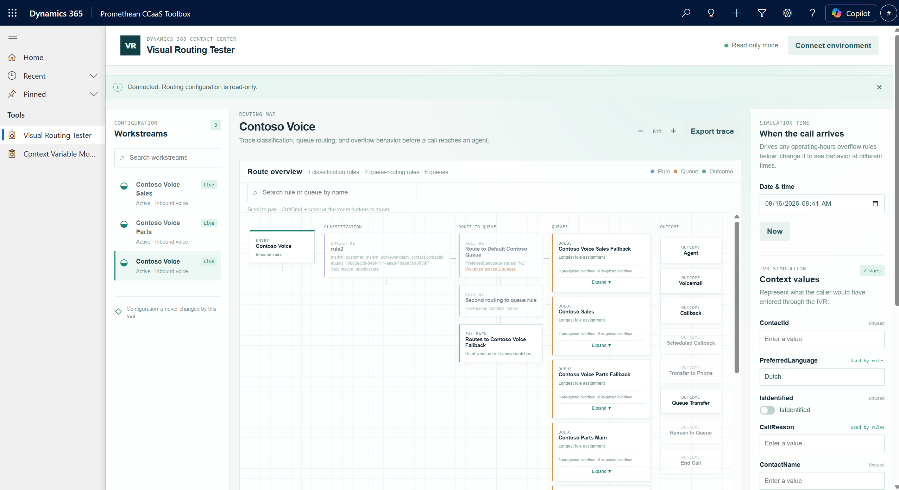
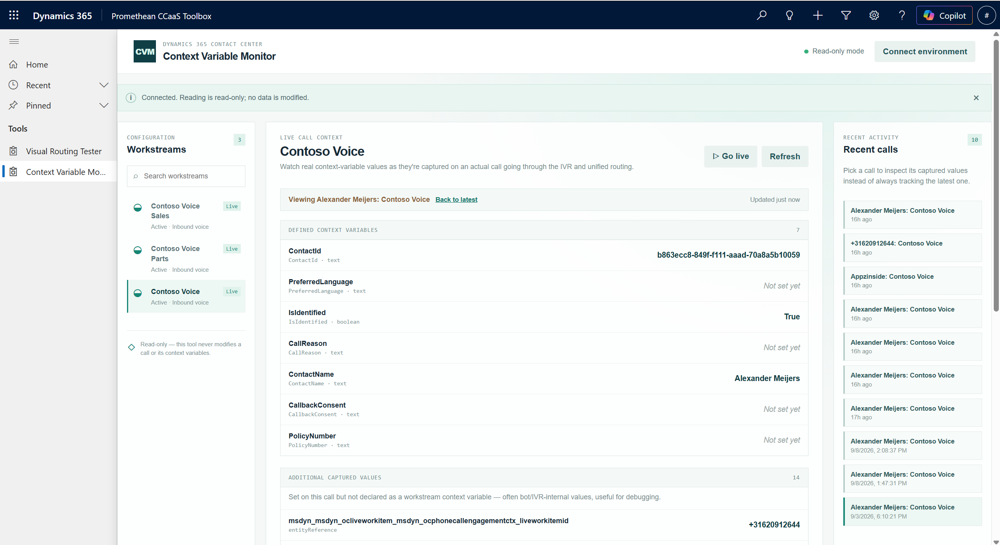
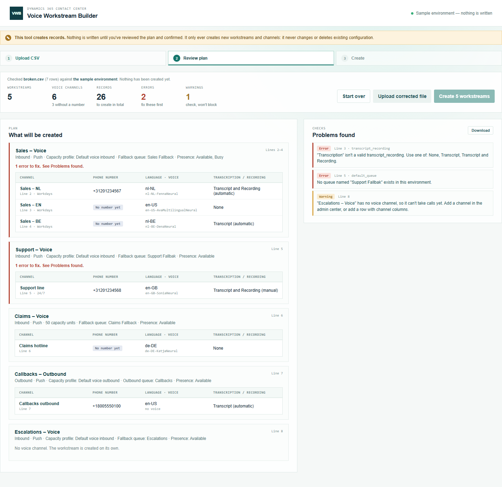
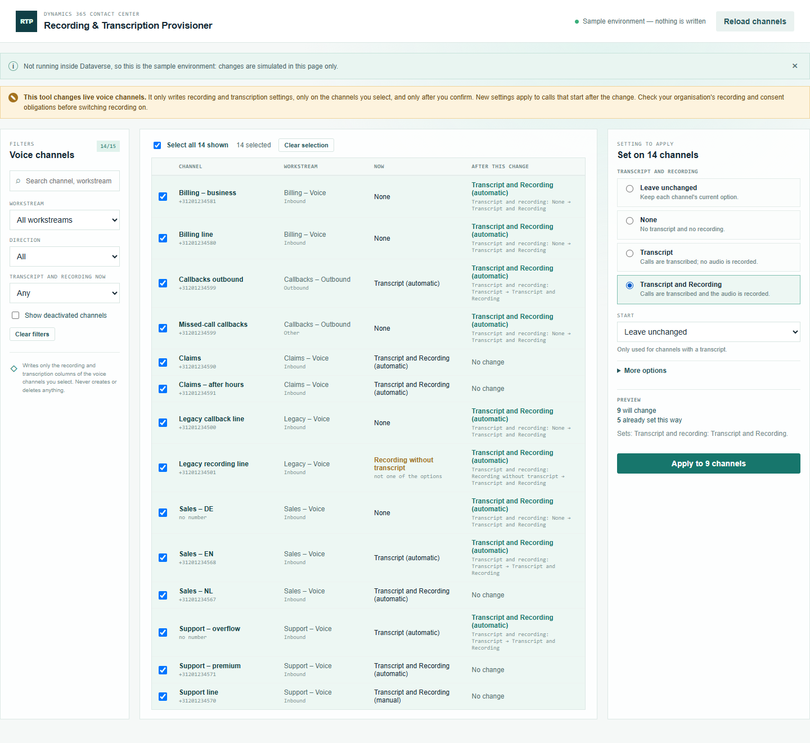
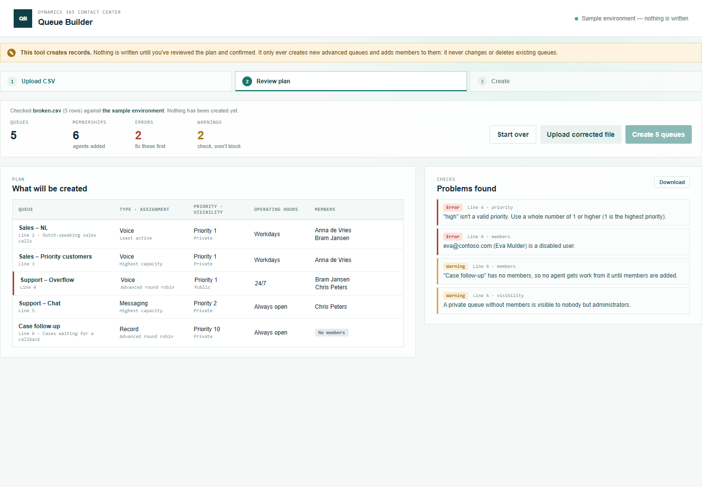
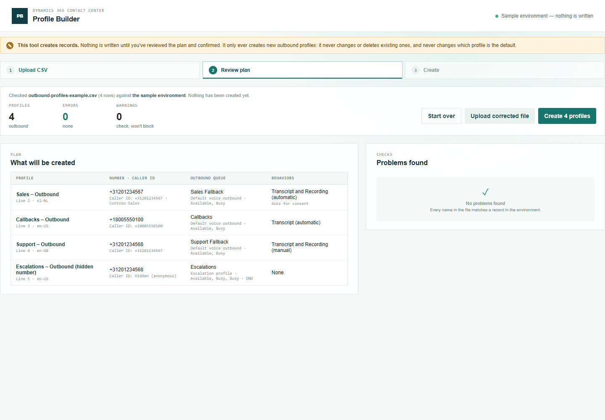

# Promethean CCaaS Toolbox

[](LICENSE)

A toolbox for administrators of **Dynamics 365 Contact Center** (unified routing). Each tool is a self-contained utility that runs inside your Dataverse environment — no external hosting, no extra sign-in. There are two kinds:

- **Diagnostic tools** are read-only: they never write to your configuration or call data.
- **Creation and provisioning tools** write configuration in bulk: they create new records from a CSV file, or apply one setting to many records at once. Each one writes only to a small, fixed set of tables and columns, shows a preview first, and writes nothing until you confirm.

## Tools

### Diagnostic tools (read-only)

| Tool | What it does |
| --- | --- |
| [Visual Routing Tester](tools/visual-routing-tester/README.md) | Visualizes a workstream's full routing configuration (classification, queues, overflow) as an interactive diagram, and lets you simulate a call against it to see exactly which rules fire and where it ends up. |
| [Context Variable Monitor](tools/context-variable-monitor/README.md) | Watches the actual context-variable values a real call captures, live, as it moves through the IVR and unified routing — for debugging against real traffic rather than simulated configuration. |
| [Agent Readiness Checker](tools/agent-readiness-checker/README.md) | Answers "why isn't this agent receiving calls?" — checks one agent or the whole roster against every prerequisite for receiving voice work (account, roles, channel, queue membership, workstream reachability, capacity, skills, presence) with plain-language evidence and suggested fixes. |
| [Environment Artifact Finder](tools/environment-artifact-finder/README.md) | Finds configuration you could clean up: records nothing active uses any more, records that are wired in but can never do anything (e.g. a voice workstream with no phone number, a queue no route reaches), broken references, and housekeeping items (old bulk-delete jobs, stale saved views). Recommends only. Every finding is a candidate for review, with its evidence and a confidence level. |

### Creation and provisioning tools

| Tool | What it does | Writes |
| --- | --- | --- |
| [Voice Workstream Builder](tools/voice-workstream-builder/README.md) | Creates voice workstreams and their voice channels in bulk from a CSV file (one row per channel, so a workstream can have several). A channel can be created without a phone number, to be assigned later. | Creates only: `msdyn_liveworkstream`, `msdyn_liveworkstreamcapacityprofile`, `msdyn_ocvoicechannelsetting`, `msdyn_ocvoice`, `msdyn_ocvoicechannellanguagesetting`. Never updates or deletes. |
| [Queue Builder](tools/queue-builder/README.md) | Creates advanced (unified routing) queues in bulk from a CSV file: type, assignment method, priority, visibility, operating hours and members. | Creates only: `queue` (advanced queues), and adds members through `queuemembership_association`. Never updates or deletes. |
| [Profile Builder](tools/profile-builder/README.md) (*Outbound Profile Builder* in the app) | Creates **outbound** profiles in bulk from a CSV file: name, phone number (required), outbound queue, caller ID and behaviors. Inbound profiles aren't supported yet. | Creates only, through Voice Workstream Builder's data layer: `msdyn_liveworkstream` (outbound), `msdyn_liveworkstreamcapacityprofile`, `msdyn_ocvoicechannelsetting`, `msdyn_ocvoicechannellanguagesetting`. Never updates or deletes, and never changes the default profile. |
| [Recording & Transcription Provisioner](tools/voice-recording-provisioner/README.md) (*Recording & Transcription* in the app) | Sets transcript and recording on a selection of voice channels at once — None, Transcript, or Transcript and Recording — with a per-channel preview, a read-back check afterwards, and a one-click revert. | Updates only the recording/transcription columns of `msdyn_ocvoicechannelsetting`. Never creates or deletes. |

<table>
<tr>
<td width="50%"><a href="tools/visual-routing-tester/README.md"></a></td>
<td width="50%"><a href="tools/context-variable-monitor/README.md"></a></td>
</tr>
<tr>
<td width="50%"><a href="tools/voice-workstream-builder/README.md"></a></td>
<td width="50%"><a href="tools/voice-recording-provisioner/README.md"></a></td>
</tr>
<tr>
<td width="50%"><a href="tools/queue-builder/README.md"></a></td>
<td width="50%"><a href="tools/profile-builder/README.md"></a></td>
</tr>
</table>

Each tool has its own README (what it does, how it works, tables read and written, build/run/deploy), an `IMPLEMENTATION_STATUS.md` (how its schema was verified, decisions, open questions, live findings), and a step-by-step manual with screenshots: [Visual Routing Tester](tools/visual-routing-tester/manual.md), [Context Variable Monitor](tools/context-variable-monitor/manual.md), [Agent Readiness Checker](tools/agent-readiness-checker/manual.md), [Environment Artifact Finder](tools/environment-artifact-finder/manual.md), [Voice Workstream Builder](tools/voice-workstream-builder/manual.md), [Queue Builder](tools/queue-builder/manual.md), [Profile Builder](tools/profile-builder/manual.md), [Recording & Transcription Provisioner](tools/voice-recording-provisioner/manual.md).

### How the creation tools work

The three creation tools share one flow and one set of conventions:

1. **Upload a CSV.** Each tool offers a **Download example CSV** (also in the tool's `examples/` folder, kept identical by a test) and an empty template. Comma-, semicolon- and tab-separated files are all read, so files saved by Excel in any locale work. Every column has a documented behavior for an **empty cell** — a default, "not set", required, or (in Voice Workstream Builder) inherited from the workstream's first row; each manual has a section *What happens when you leave a cell empty*.
2. **Review.** Every row is checked, then every name in the file (queues, numbers, users, languages, music, operating hours, capacity profiles) is matched against the environment, and new names against existing records. Problems are listed per line and column; **errors block creation, warnings don't. Nothing is written in this step.**
3. **Create.** After a confirmation that names the target environment, records are created one by one and reported with status, id and a link. A failure stops only the affected item; nothing is ever deleted automatically.
4. **Download log.** A CSV of the run: tool, environment, user, start and finish time, and every record with its status, id and time, plus notes and the warnings accepted at review.

The provisioning tool (Recording & Transcription Provisioner) works on a selection instead of a file: filter and select records, choose the setting, check the per-record preview, confirm, and afterwards download the log or revert.

### Live status

All tools have been built against schema read from a live environment (`academyexperiment`) and run end to end in a browser against sample data. What has also been confirmed by creating or changing records live:

| Tool | Confirmed live |
| --- | --- |
| Diagnostic tools | In use against the live environment; see each tool's *Live findings*. |
| Voice Workstream Builder | Workstreams and channels without a phone number are created and completed by the platform. Routing rules are **not** created automatically: set them up in the admin center (the tool says so per workstream). |
| Queue Builder, Profile Builder, Recording & Transcription Provisioner | Deployed; not yet confirmed with a live run. Each tool's `IMPLEMENTATION_STATUS.md` lists what to check on the first run. |

## Getting the toolbox into your environment

The toolbox is packaged as a single **unmanaged Dataverse solution** that bundles the tools' web resources plus the "Promethean CCaaS Toolbox" model-driven app that surfaces them in a Site Map. Unmanaged is deliberate here, not a default: it keeps every component editable after import (so you can re-share the app with your own security roles — see [Required setup after import](#required-setup-after-import) — and so `deploy.ps1` can update it later), and it matches what `deploy.ps1` (Option B) requires as a target.

### Option A — Import the packaged solution (fastest, no build tooling required)

> 📦 Solution zip: [`power_platform_solution/PrometheanCCaaSToolbox_1_0_0_4.zip`](power_platform_solution/PrometheanCCaaSToolbox_1_0_0_4.zip)
>
> **Version 1.0.0.4 contains all eight tools**, already in the app's Site Map in three groups: **Tools** (the four diagnostic tools), **Creation** (Voice Workstream Builder, Queue Builder, Outbound Profile Builder) and **Provisioning** (Recording & Transcription). See [Site Map subareas](#site-map-subareas).

Via the Power Platform maker portal:
1. Go to [make.powerapps.com](https://make.powerapps.com) and switch to the target environment.
2. **Solutions** → **Import solution** → browse to the zip above → **Next** → confirm the publisher → **Import**.
3. Once import finishes, complete the [required setup below](#required-setup-after-import) before the app will be usable.

Via the `pac` CLI:
```powershell
pac auth create --url https://your-org.crm.dynamics.com
pac solution import --path power_platform_solution/PrometheanCCaaSToolbox_1_0_0_4.zip --publish-changes
```

After import, the solution's unique name in that environment is `PrometheanCCaaSToolbox` (publisher prefix `pct_`, the names baked into the zip's `solution.xml`). This is also the name to put in `deploy.config.json` as `solutionUniqueName` if you plan to push code changes into that environment later with `deploy.ps1` — see [deploy.config.json reference](#deployconfigjson-reference) below.

### Option B — Build and deploy each tool yourself from this repo

See [Deployment](#deployment) below. Use this to deploy a newer build of a tool than the one in the solution zip, or to a solution of your own.

### Required setup after import

Importing the solution (either option) does **not** make the toolbox usable on its own — some things are tied to the environment and don't carry over:

1. **Share the app with security roles.** The "Promethean CCaaS Toolbox" model-driven app is shared with specific security roles from the environment it was exported from; those role IDs won't exist in your environment, so by default **no one will see the app in the app picker**. In the maker portal, go to **Apps**, select **Promethean CCaaS Toolbox**, choose **Share**, and add whichever security roles/users in your environment should have access. This step is required in every new target environment, regardless of import method.
2. **Confirm Dynamics 365 Contact Center (unified routing) is provisioned, and that users have read access to it.** The diagnostic tools read live routing/call/agent/configuration data (`msdyn_liveworkstream`, `msdyn_ocliveworkitem`, `msdyn_ocliveworkitemcontextitemelastic`, `queuemembership`, and related tables — see each tool's own README for its full table list) at runtime — this isn't checked at solution-import time, so import will succeed even in an environment without Contact Center, but the tools will show empty/unverifiable data instead of real results. The toolbox doesn't ship its own security role; users need read privileges on those tables through whatever routing/queue-admin role your environment already uses.
3. **Limit the creation and provisioning tools to administrators.** They're meant for **system administrators** (or roles with create/write privileges on the tables in the [Writes](#creation-and-provisioning-tools) column). Dataverse enforces the user's own privileges on every write; the Site Map already keeps them apart in the **Creation** and **Provisioning** groups, so you can hide those groups from non-admin roles.

### Site Map subareas

Each tool is a Site Map subarea of **Type: Web Resource** that points at the tool's `index.html` (the page loads its own `style.css` and `bundle.js`). In the Site Map designer, pick the web resource by name; in the Site Map XML it's stored as `$webresource:<name>`. Solution zip 1.0.0.4 already has all of them, in the app's **CCaaS Toolbox** area:

| Group | Subarea title | Web resource |
| --- | --- | --- |
| Tools | Visual Routing Tester | `pct_/tools/routingtester/index.html` |
| Tools | Context Variable Monitor | `pct_/tools/contextvariablemonitor/index.html` |
| Tools | Agent Readiness Checker | `pct_/tools/agentreadiness/index.html` |
| Tools | Environment Artifact Finder | `pct_/tools/artifactfinder/index.html` |
| Creation | Voice Workstream Builder | `pct_/tools/voicebuilder/index.html` |
| Creation | Queue Builder | `pct_/tools/queuebuilder/index.html` |
| Creation | Outbound Profile Builder | `pct_/tools/profilebuilder/index.html` |
| Provisioning | Recording & Transcription | `pct_/tools/recordingprovisioner/index.html` |

When you add a tool to an environment yourself, add a subarea the same way. Until it exists, a deployed tool can be opened inside the app with `https://<org>.crm.dynamics.com/main.aspx?appid=<app id>&pagetype=webresource&webresourceName=<web resource>`. Open it inside the app, not as a bare web resource URL: outside the app the tool can't reach Dataverse and shows its sample data instead (the topbar says which one you're looking at).

## Architecture

Every tool in this toolbox is a plain HTML/CSS/React (TypeScript) app, deployed as a trio of Dataverse **web resources** (`index.html`, `bundle.js`, `style.css`) and surfaced as its own subarea in a model-driven app's Site Map — not a PCF control, not a Custom Page.

**Why web resources, not PCF:** PCF controls are for reusable, data-bound components that plug into a single field/form/grid. Every tool in this toolbox is a standalone full-page utility with no binding to one record or column, which is exactly what a web resource is for — PCF and Custom Pages were tried first and ran into bound-property requirements and sizing/hosting constraints that don't fit this shape. Only a future tool that genuinely needs to embed inside an existing record's form (e.g. a mini routing-preview widget on a workstream form) would justify a PCF control instead.

All tools:
- Talk to Dataverse with the signed-in user's existing session — mostly through `Xrm.WebApi`, and through the same-origin Web API where `Xrm.WebApi` has no helper (metadata reads, adding queue members) — so no separate Microsoft Entra ID app registration or manual OAuth setup is required, and Dataverse applies the user's own privileges.
- Live in one Dataverse solution and one model-driven app/Site Map, rather than one solution per tool.
- Include a fully working **offline demo mode** with bundled sample data, so you can try them out locally without a Dataverse connection. In the writing tools, demo mode simulates the writes in memory.
- Keep every Dataverse call in one `dataverse.ts` per tool. Profile Builder has none of its own: it uses Voice Workstream Builder's.

**Read-only vs. writing.** The diagnostic tools are **read-only**: none of them ever creates, updates or deletes a record, and each has a `readOnly.test.ts` that enforces it. The creation and provisioning tools write, but each within a fixed scope (the [Writes](#creation-and-provisioning-tools) column): their `dataverse.ts` refuses anything outside it at runtime (tables, and for the provisioner columns), and each has a `writeScope.test.ts` that fails the build if the code could write outside it. No tool deletes anything. Writes happen only after a preview and an explicit confirmation that names the target environment, and every run can be downloaded as a log.

**Verified schema.** Before a writing tool writes a column, that column, its option values and its navigation property were read from a live environment's metadata and from records the admin center itself created; nothing written is guessed. Each tool's `IMPLEMENTATION_STATUS.md` has the details ("Step 0").

**Shared code.** The writing tools share Voice Workstream Builder's CSV reader, run log and recording/transcription settings (`tools/voice-workstream-builder/src/`), so all of them read files, write logs and store transcript/recording options the same way. Diagnostic tools reuse Visual Routing Tester's decision-ruleset parser.

## Repository layout

```
tools/
  visual-routing-tester/       # Diagnostic — src, tests, webresource, css, docs
  context-variable-monitor/    # Diagnostic
  agent-readiness-checker/     # Diagnostic
  environment-artifact-finder/ # Diagnostic
  voice-workstream-builder/    # Creation — also holds the shared CSV, log and recording code
  queue-builder/               # Creation
  profile-builder/             # Creation (outbound profiles)
  voice-recording-provisioner/ # Provisioning
power_platform_solution/       # Packaged unmanaged solution zip (see Option A above)
webpack.config.js              # One build entry per tool
deploy.config.json             # Per-environment / per-tool deploy configuration
scripts/deploy.ps1             # Deploy script (see below)
```

Each tool folder follows the same layout: `src/` (code), `tests/`, `webresource/` (`index.tsx` entry and the page's html), `css/`, `images/` (manual screenshots), `README.md`, `IMPLEMENTATION_STATUS.md`, `manual.md`, and for the creation tools `examples/` (the example CSV).

All tools share one npm project and one webpack config (one named build entry per tool) rather than separate projects per tool, since they're all the same stack at a scale that doesn't yet justify a monorepo/workspaces setup.

## Development

```powershell
npm install
npm test        # every tool's tests
npm run build   # every tool's bundle, into dist/webresource/<toolkey>/
```

Each tool can be run locally in its offline demo mode:

| Tool | Deploy key (`-Tool`) | Demo |
| --- | --- | --- |
| Visual Routing Tester | `routingtester` | see its README |
| Context Variable Monitor | `contextvariablemonitor` | see its README |
| Agent Readiness Checker | `agentreadiness` | `npm run demo:agentreadiness` → http://localhost:5434/index.html |
| Environment Artifact Finder | `artifactfinder` | `npm run demo:artifactfinder` → http://localhost:5435/index.html |
| Voice Workstream Builder | `voicebuilder` | `npm run demo:voicebuilder` → http://localhost:5436/index.html |
| Recording & Transcription Provisioner | `recordingprovisioner` | `npm run demo:recordingprovisioner` → http://localhost:5437/index.html |
| Queue Builder | `queuebuilder` | `npm run demo:queuebuilder` → http://localhost:5438/index.html |
| Profile Builder | `profilebuilder` | `npm run demo:profilebuilder` → http://localhost:5439/index.html |

## Deployment

Deployment targets and per-tool web resource mappings are defined in [`deploy.config.json`](deploy.config.json) — this is the source of truth for which environment/solution each tool deploys to, not something to keep in your head.

```powershell
pwsh ./scripts/deploy.ps1 -Tool <toolkey>
```

The script builds the project, stages non-webpack files, stamps a fresh cache-busting version automatically, looks up each web resource by name in the target environment (never hardcoding a GUID), updates its content, publishes, and verifies the result by reading the live content back. Requires the Azure CLI (`az`) to be logged in with access to the target environment. Add `-CreateIfMissing` the first time a new tool's web resources don't exist yet in the target environment (this also adds each newly-created web resource to the solution named by `solutionUniqueName`). After a first deploy, add the tool's [Site Map subarea](#site-map-subareas).

The script only deploys the tools' own web resources; it never touches Contact Center configuration, and it doesn't change the Site Map — add a subarea for a tool that's new to an environment (see [Site Map subareas](#site-map-subareas)). To refresh the solution zip in `power_platform_solution/`, export the solution from the environment after deploying.

```powershell
# First deploy of a tool into an environment where its web resources don't exist yet:
pwsh ./scripts/deploy.ps1 -Tool queuebuilder -CreateIfMissing

# Routine redeploy after that, against a non-default environment:
pwsh ./scripts/deploy.ps1 -Tool queuebuilder -Environment test
```

### deploy.config.json reference

```json
{
  "defaultEnvironment": "dev",
  "environments": {
    "dev": {
      "url": "https://academyexperiment.crm.dynamics.com",
      "solutionUniqueName": "PrometheanCCaaSToolbox"
    }
  },
  "tools": {
    "routingtester": {
      "displayName": "Visual Routing Tester",
      "stage": [
        { "from": "tools/visual-routing-tester/webresource/routingtester.html", "to": "dist/webresource/routingtester/index.html" }
      ],
      "webResources": [
        { "name": "pct_/tools/routingtester/index.html", "path": "dist/webresource/routingtester/index.html", "type": 1, "displayName": "Visual Routing Tester - index.html", "cacheBust": true }
      ]
    }
  }
}
```

| Field | Meaning | When you need to change it |
| --- | --- | --- |
| `defaultEnvironment` | Key into `environments` used when `-Environment` isn't passed to `deploy.ps1`. | Rarely — only if the "usual" target org changes. |
| `environments.<key>` | One entry per Dataverse environment you deploy to. | Add a new key (e.g. `test`, `prod`) before deploying to a new org for the first time. |
| `environments.<key>.url` | The environment's base API URL, e.g. `https://your-org.crm.dynamics.com` (no trailing slash). Used both to request an access token and as the base for every Web API call. | Set once per environment, when you add it. |
| `environments.<key>.solutionUniqueName` | Unique name (not display name) of the Dataverse solution the web resources belong to. | Set to the solution you imported in [Option A](#option-a--import-the-packaged-solution-fastest-no-build-tooling-required) (or an existing solution) for that environment — needed whenever `-CreateIfMissing` has to add a newly-created web resource to a solution. |
| `tools.<toolkey>` | One block per tool; the key is what you pass to `-Tool`. | Add a new block when adding a new tool to the toolbox (see below). |
| `tools.<toolkey>.displayName` | Human-readable name, used only in deploy log output. | Cosmetic only. |
| `tools.<toolkey>.stage` | List of `{ "from", "to" }` file copies run before upload, for non-webpack files (html/css) that need to land next to the webpack bundle output. Both paths are repo-relative. | Update if a tool's source html/css file moves, or when adding a new tool. |
| `tools.<toolkey>.webResources` | The actual Dataverse web resources to create/update — one entry per `index.html` / `.css` / `.js`. | Update whenever a tool gains/loses a web resource, or when adding a new tool. |
| `webResources[].name` | The Dataverse web resource's unique name (e.g. `pct_/tools/routingtester/index.html`). This is how the script looks the resource up live — **never** a GUID. Must use the same publisher prefix / path scheme as the resources already in the target solution. | Must match exactly what exists (or should exist) in the target environment. |
| `webResources[].path` | Repo-relative path to the local built file whose content gets uploaded. | Must match the `to` of the corresponding `stage` entry (for html/css) or the webpack output path (for the bundle `.js`). |
| `webResources[].type` | Dataverse web resource type code: `1` = HTML, `2` = CSS, `3` = JS/script. | Set once per resource, based on its file type. |
| `webResources[].displayName` | Display name used only when creating the resource for the first time (`-CreateIfMissing`). | Cosmetic, but only takes effect on creation. |
| `webResources[].cacheBust` | `true` to have the script stamp a fresh `?v=<timestamp>` query string into the `<script>`/`<link>` references inside this file on every deploy. | Set on the `index.html` entry (which references the css/js), not on the css/js entries themselves. |

Adding a new tool to the toolbox means: a new `tools/<toolname>/` folder following the existing layout, a new webpack entry, a new `tools.<toolkey>` block in `deploy.config.json` (following the `pct_/tools/<toolkey>/...` naming convention already used by the other tools), a `demo:<toolkey>` script in `package.json`, its own `README.md`, `IMPLEMENTATION_STATUS.md` and `manual.md`, a row in the tables above, and — for a tool that writes — a `writeScope.test.ts`.

## License

[MIT](LICENSE) © Alexander Meijers. Free to use, modify, and redistribute — the copyright notice and license text must stay in every copy.
