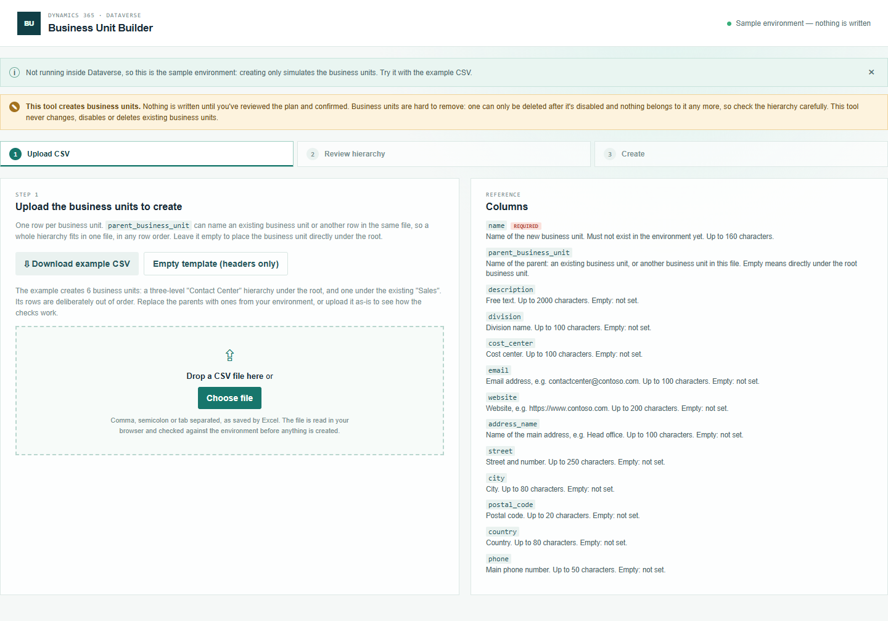
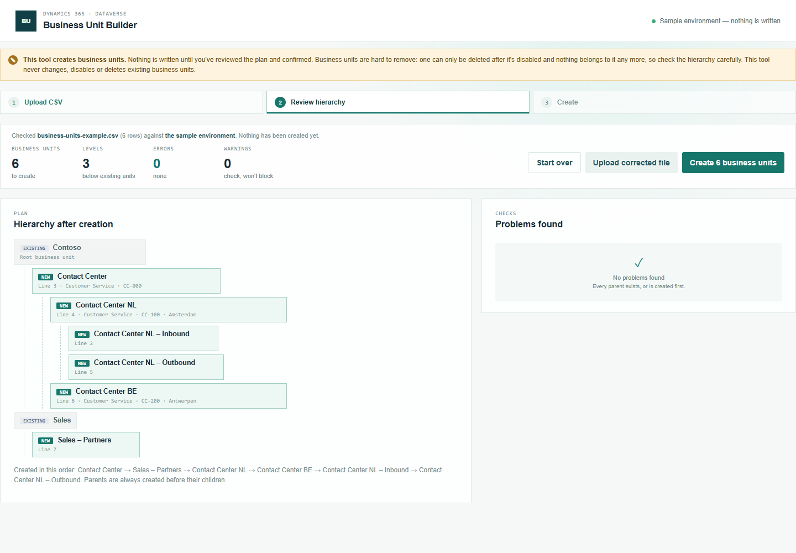
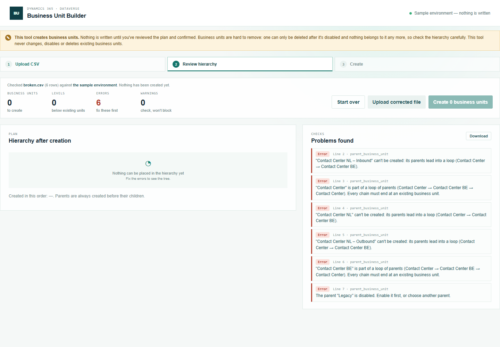
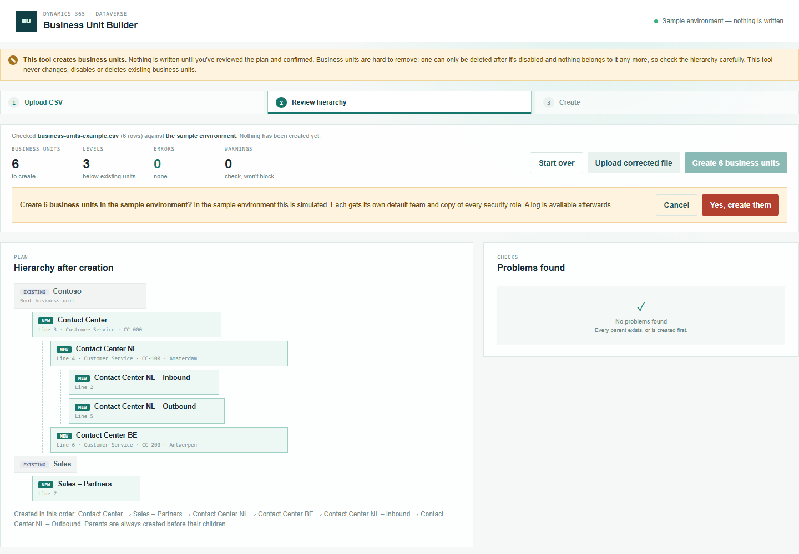
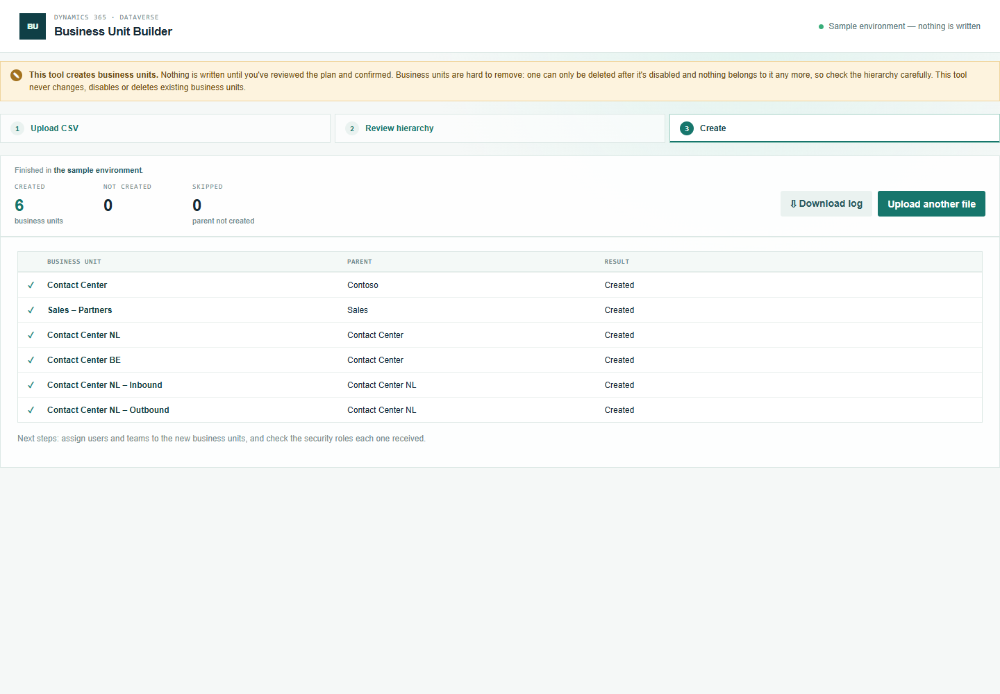

# Business Unit Builder — manual

Create business units, including whole hierarchies, from a CSV file. Nothing is written until you've reviewed the hierarchy and confirmed it.

## 1. Prepare the CSV

Open **Business Unit Builder** from the Promethean CCaaS Toolbox app. The topbar shows which environment the tool will create business units in.

Click **Download example CSV** and open it in Excel. It creates 6 business units — a three-level "Contact Center" hierarchy under the root, and one under the existing "Sales" — and uses every column. (**Empty template** gives just the column headers.) Each row is one business unit:

- `name` is the name of the new business unit. It must not exist yet.
- `parent_business_unit` is where it goes: the name of an **existing** business unit, or of **another row in the same file**. So "Contact Center NL – Inbound" can sit under "Contact Center NL", which sits under "Contact Center", all in one file. The rows don't have to be in order — the tool works out which to create first.
- The other columns (description, division, cost center, email, website, address and phone) are optional details.

### What happens when you leave a cell empty

A column you leave out of the file entirely counts as empty in every row. Only `name` must be present as a column.

| Column | Empty means |
| --- | --- |
| `name` | **Error** — every row needs a name. |
| `parent_business_unit` | The business unit goes **directly under the root** business unit (the top of your organization). |
| Every other column | **Not set.** You can fill it in later on the business unit in the Power Platform admin center. |

There are no hidden defaults: the tool writes only the columns you fill in, plus the parent.

## 2. Upload and review the hierarchy

Drop the file on the upload area, or click **Choose file**. **Nothing is created at this point.**

**Hierarchy after creation** shows the existing business units that get new children (marked *Existing*) with the new business units nested under them (marked *New*), each with its line in the file and its division, cost center and city. Below the tree, **Created in this order** shows the order the tool will use: every parent before its children.

**Problems found** lists every issue by line and column. In this example two rows point at each other as parent — a loop — so neither they nor the business units below them can be created; and one row has a **disabled** parent. Fix the file, then click **Upload corrected file**.

## 3. Create

When there are no errors, click **Create N business units**. The confirmation names the environment, and reminds you that business units are hard to remove later:

Click **Yes, create them** and keep the page open until it has finished.

Each business unit shows its parent and result; in a live environment the name links to the record.

- If a business unit can't be created, it's marked **Not created** with the reason, and everything below it is **Skipped** (it has no parent to go under). Other branches still go ahead.
- Every new business unit gets its own **default team** and copy of every **security role** from the platform. The tool checks the default team and notes it if it's missing.
- **The tool never deletes anything.** To remove a business unit, disable it in the Power Platform admin center, then delete it — which only works while no users, teams or records belong to it.

Next: move users and teams into the new business units in the Power Platform admin center. Moving a user removes their security roles, so assign the right roles again afterwards.

## 4. Download the log

**Download log** saves the run as a CSV: the environment, the user, when it ran, and every business unit with its parent, status, id and time.

## Running the same file again

Names must be new, so running the same file again reports every created business unit as "already exists" and creates nothing twice.
