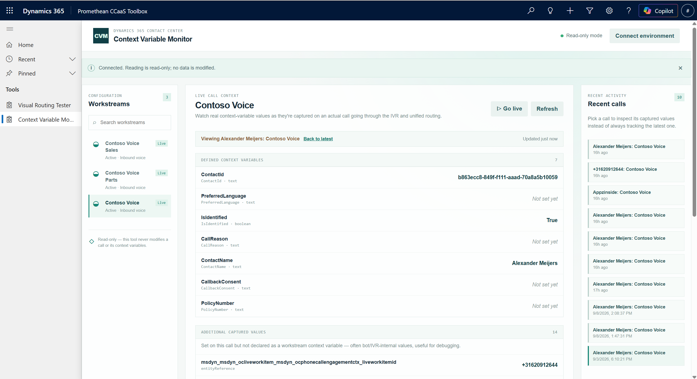
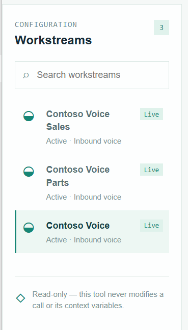
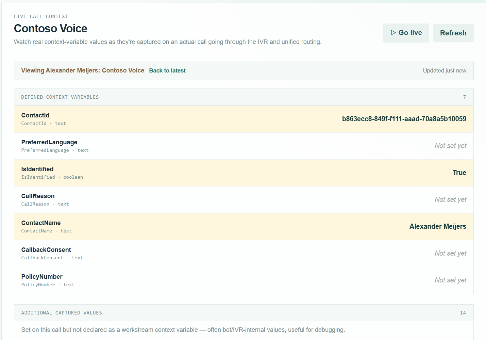
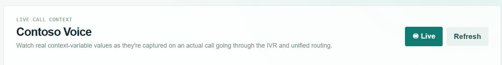
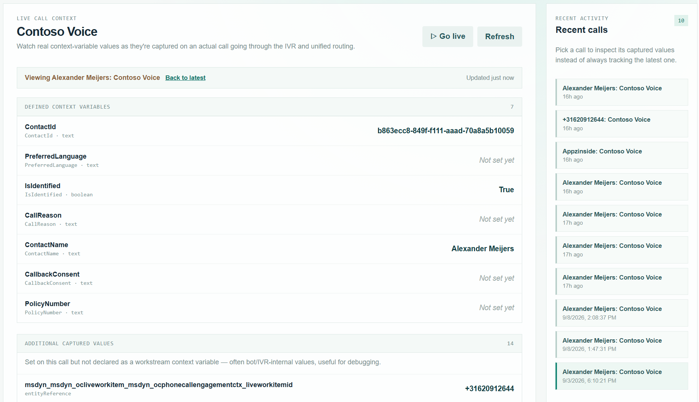

# Context Variable Monitor — User Manual

Part of the [Promethean CCaaS Toolbox](../../Readme.md). For what the tool does and how it's built, see the [README](README.md). This manual walks through actually using it.

## 1. Opening the tool

1. In your Dynamics 365 Contact Center model-driven app, open the **Context Variable Monitor** subarea from the Site Map.
2. On load, the tool connects using your own signed-in session and lists your environment's **inbound voice workstreams** in the left sidebar (same filter as Visual Routing Tester).
3. If it can't reach Dataverse, it falls back to a **demo workstream** with a scripted sequence of snapshots — a banner says "Demo data is shown until a Dataverse connection is available." Every Refresh/Live tick in demo mode advances to the next preset snapshot, so you can see values "fill in" without a real call.

## 2. Selecting a workstream

1. Use the **Search workstreams** box in the left sidebar to filter by name.
2. Click a workstream to load it. The main panel switches to show **"Live call context"** for that workstream, tracking its most recent call by default.

## 3. Watching values on the latest call

By default the tool tracks the **latest call** on the selected workstream. The main panel shows two tables:

- **DEFINED CONTEXT VARIABLES** — every officially-defined context variable for the workstream, each with its current captured value, or **"Not set yet"** if the call hasn't reached that point yet.
- **ADDITIONAL CAPTURED VALUES** — anything the call set that isn't a formally-defined context variable (bot/IVR-internal values). Useful for debugging values the bot captures but nobody declared.

When a value newly appears or changes between refreshes, it's briefly **highlighted** so it's easy to spot mid-call.

## 4. Refresh vs. Live mode

There are two ways to pull updated values:

- **Refresh** — a manual, one-time pull of the latest data. Works regardless of whether Live is on.
- **▷ Go live / ◉ Live** — toggles auto-polling every 4 seconds. It **starts paused** by design — turn it on right before you place a test call, so you can watch values fill in as the call progresses through the IVR and unified routing.

## 5. Reviewing a past call instead of the latest

Instead of always tracking the newest call, you can pin an older one:

1. In the **Recent calls** panel (right side), browse the last 10 calls for the selected workstream.
2. Click a call to pin it — the main panel switches to show that call's captured values instead of the latest one, and a badge reading **"Viewing <call> "** appears with a **Back to latest** link.
3. Click **Back to latest** to resume tracking the newest call.

## Notes

- This tool is **read-only**: it never writes to a call or its context variables. Everything shown is data the platform already captured.
- Context Variable Monitor shows what a **real call actually did**. To simulate hypothetical calls against a workstream's configuration instead, use [Visual Routing Tester](../visual-routing-tester/manual.md).

