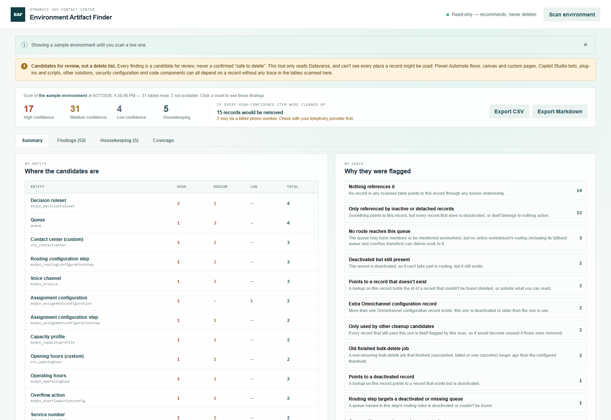
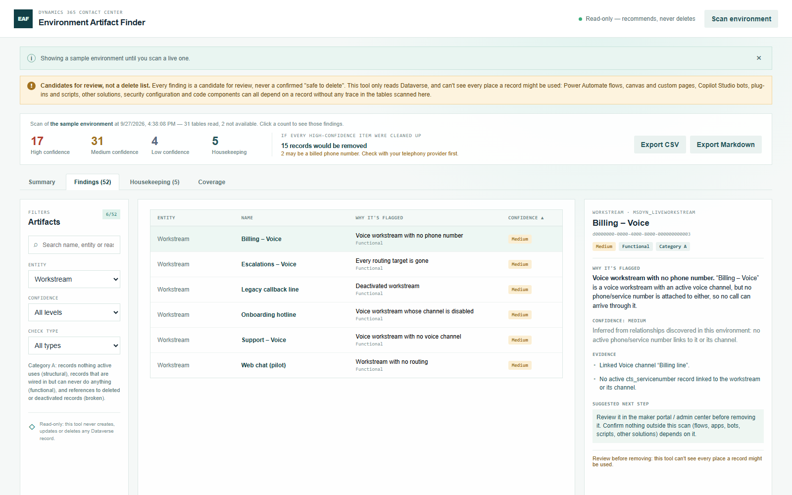
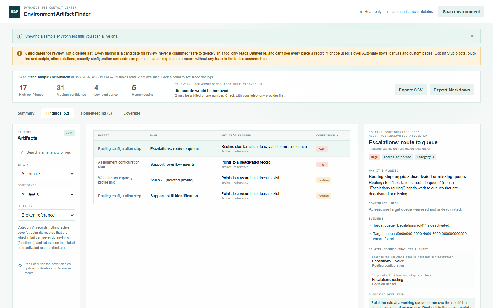
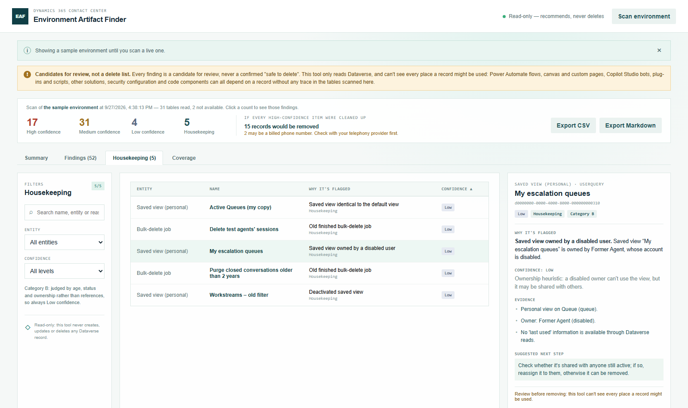
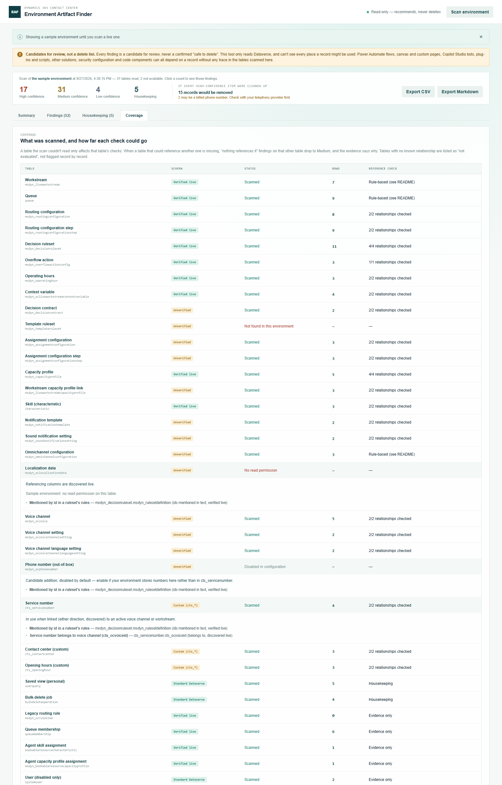

# Environment Artifact Finder — User Manual

Part of the [Promethean CCaaS Toolbox](../../Readme.md). For what the tool checks and how, see the [README](README.md). This manual walks through using it.

## 1. Opening the tool and scanning

1. In the Promethean CCaaS Toolbox model-driven app, open the **Environment Artifact Finder** subarea from the Site Map.
2. It first shows a **sample environment**, and the notice bar says so. Everything below works the same on sample data.
3. Click **Scan environment** to scan your own environment. The notice bar shows progress table by table (for example "Reading queue records (queue)… (34/66)"). A scan reads around 30 tables, so expect it to take a few seconds up to a minute, depending on how much configuration you have.
4. Nothing is changed by scanning. The tool only reads.

The orange bar under the notice is always there and can't be dismissed. It's the most important thing on the page: **every finding is a candidate for review, not a delete list.** The tool can't see flows, apps, bots, plug-ins, other solutions or security configuration that might use a record.

## 2. Reading the summary

- **High / Medium / Low confidence:** Category A findings at each level. Click a count to open the Findings tab filtered to that level.
- **Housekeeping:** the number of Category B findings. Click it to open the Housekeeping tab.
- **"If every High-confidence item were cleaned up":** how many distinct records that would remove. Broken references aren't counted, because they're usually fixed by repointing, not by removing the record. If any flagged record may be a real, billed phone number, a note appears here. Check with your telephony provider before releasing a number.
- **By entity:** where the candidates are. Click a row to see that entity's findings.
- **By check:** why records were flagged, with a one-line description of each check. Click one to see those findings.
- **Not fully checked:** any check that was skipped because its data couldn't be read (only shown when that happens).

## 3. Reviewing findings

Open the **Findings** tab. Filter by **Entity**, **Confidence** and **Check type** (structural, functional, broken reference), search by name, entity or reason, and click a column header to sort. The list shows 10 findings per page.

Click a row to open the detail panel on the right:

- **Why it's flagged:** a plain-language explanation.
- **Confidence:** the level, and *why* it's that level. For example: "Inferred from routing logic", or "some relationships couldn't be checked".
- **Evidence:** what was checked, and what was or wasn't found.
- **Related records that still exist:** what uses this record, what it belongs to, and what it points to, with each record's state. In a live environment each one is a link that opens the record in a new tab. **Open this record ↗** opens the flagged record itself.
- **Suggested next step:** always "review because…", never "delete".

Broken references appear here too. Filter **Check type → Broken reference** to see steps and links that point at deleted or deactivated records.

### How to work through the list

1. Start with **High** confidence. These are records that nothing in the scanned configuration points to.
2. Then **Medium**. Read the confidence reason: some are inferred from routing logic, some only lost High because a table couldn't be read.
3. For **Only used by other cleanup candidates**, review the records that use it first. It only becomes unused once they're gone.
4. **Low** findings are hints. Confirm with the owner of the configuration before acting on them.

## 4. Housekeeping

The **Housekeeping** tab lists old finished bulk-delete jobs and personal views (on Contact Center tables only) that are owned by a disabled user, identical to the default view, or deactivated. These are judged by age, state and ownership, not references, so they're always Low confidence and kept apart from the main list.

## 5. Coverage: what was scanned

The **Coverage** tab lists every table the tool knows about:

- **Schema:** how well it's known. *Verified live* (confirmed by another toolbox tool), *Standard Dataverse*, *Unverified*, or *Custom (cts_\*)*.
- **Status:** *Scanned*, *Not found in this environment*, *No read permission*, *Could not be read*, or *Disabled in configuration*.
- **Reference check:** how many of the relationships that could keep its records in use were checked. *Not evaluated* means no relationship is known, so none of its records are flagged.

Click a row to see each relationship, where it came from (*verified live* or *discovered live* from your environment's own metadata), and why any relationship couldn't be checked.

## 6. Exporting

**Export CSV** and **Export Markdown** in the summary strip export the list currently shown on the Findings or Housekeeping tab, with your filters and sort applied. Both files start with the disclaimer, so a forwarded file can't be mistaken for a delete list.

## Notes

- This tool is **strictly read-only**. Removing anything is always a separate, deliberate step you take in the maker portal or admin center.
- To see *why* a workstream routes the way it does, use the [Visual Routing Tester](../visual-routing-tester/manual.md). To see what a real call captures in its context variables (for example, before removing an "unused" one), use the [Context Variable Monitor](../context-variable-monitor/manual.md).
