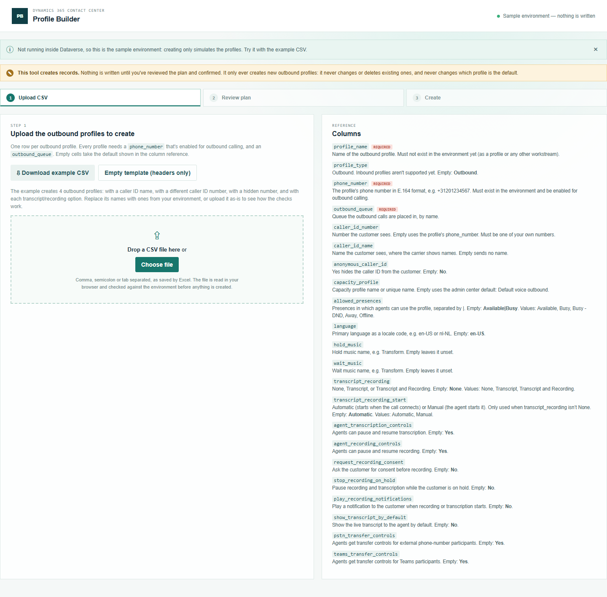
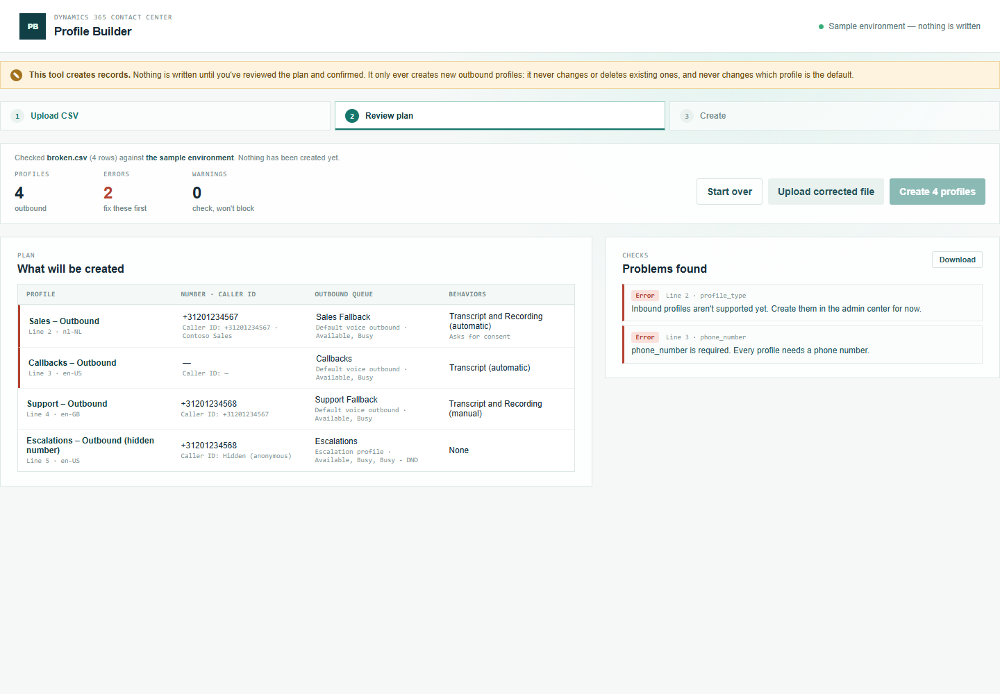
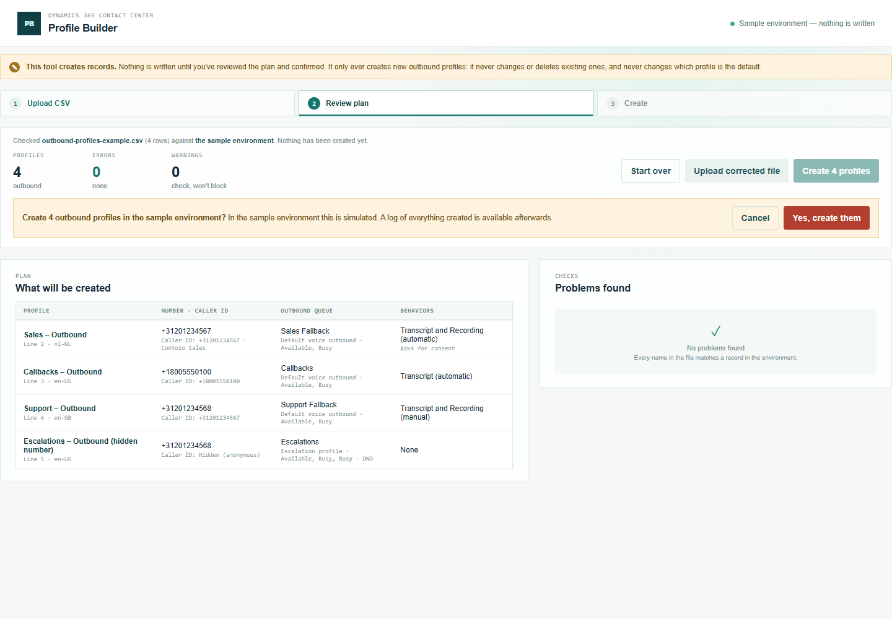
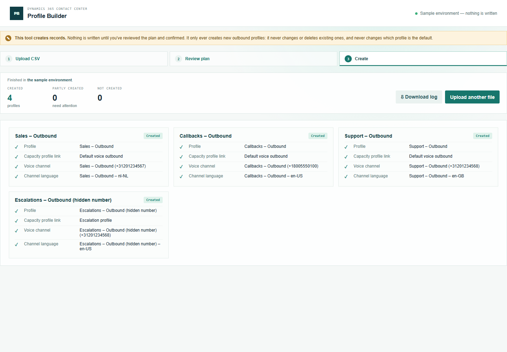

# Profile Builder — manual

Create outbound profiles from a CSV file. Nothing is written until you've reviewed the plan and confirmed it.

## 1. Prepare the CSV

Open **Profile Builder** from the Promethean CCaaS Toolbox app. The topbar shows which environment the tool will create profiles in.

Click **Download example CSV** and open it in Excel. It creates 4 outbound profiles and uses every column, so it doubles as a reference. (**Empty template** gives just the column headers.) Each row is one outbound profile:

- `profile_name` is the name of the new profile. It must not exist yet.
- `phone_number` is the profile's number, e.g. `+31201234567`. It's **required**: the number must already be in the environment and be enabled for outbound calling.
- `outbound_queue` is the queue the outbound calls are placed in. **Required.**
- `caller_id_number` and `caller_id_name` are what the customer sees. `anonymous_caller_id` set to Yes hides them.
- The behavior columns (`transcript_recording`, `request_recording_consent`, …) work the same as in Voice Workstream Builder. `transcript_recording` is **None**, **Transcript**, or **Transcript and Recording**.

Only **outbound** profiles can be created for now. Create inbound profiles in the admin center.

### What happens when you leave a cell empty

A column you leave out of the file entirely counts as empty in every row. Only `profile_name` must be present as a column.

**Required — an empty cell is an error:** `profile_name`, `phone_number`, `outbound_queue`.

**The tool uses its default.** These match the outbound profile the admin center created in the reference environment, except where marked.

| Column | Empty means |
| --- | --- |
| `profile_type` | Outbound |
| `caller_id_number` | The profile's own `phone_number` |
| `anonymous_caller_id` | No: the caller ID is shown |
| `capacity_profile` | Default voice outbound |
| `allowed_presences` | Available and Busy |
| `language` | en-US |
| `transcript_recording` | **None: no transcript and no recording.** Fill it in if the profile needs it. |
| `transcript_recording_start` | Automatic |
| `agent_transcription_controls`, `agent_recording_controls` | Yes |
| `request_recording_consent`, `stop_recording_on_hold`, `play_recording_notifications`, `show_transcript_by_default` | No |
| `pstn_transfer_controls`, `teams_transfer_controls` | Yes |

**Nothing is set** (you can fill it in later in the admin center):

| Column | Empty means |
| --- | --- |
| `caller_id_name` | No caller ID name is sent. |
| `hold_music`, `wait_music` | **No music set.** The admin center uses "Transform", so fill these in for the same result. |

**Never set by this tool:** whether the profile is the **default** outbound profile (set that in the admin center), and the outbound call region allow-list.

## 2. Upload and review

Drop the file on the upload area, or click **Choose file**. **Nothing is created at this point.**

**What will be created** shows each profile with its number, the caller ID the customer will see (or *Hidden*), its outbound queue, capacity profile and presences, and its behaviors.

**Problems found** lists every issue by line and column. In this example one row asks for an Inbound profile, and another has no phone number. Fix the file, then click **Upload corrected file**.

## 3. Create

When there are no errors, click **Create N profiles** and confirm:

Each profile shows its records: the profile, its capacity profile link, its voice channel (with the number) and its language. In a live environment each links to the record. If a record fails, that profile stops (**Partly created**) and the others go ahead; nothing is deleted.

## 4. Download the log

**Download log** saves the run as a CSV: the environment, the user, when it ran, and every record with its status, id and time.

## Running the same file again

Profile names must be new, so running the same file again reports every created profile as "already exists" and creates nothing twice.
