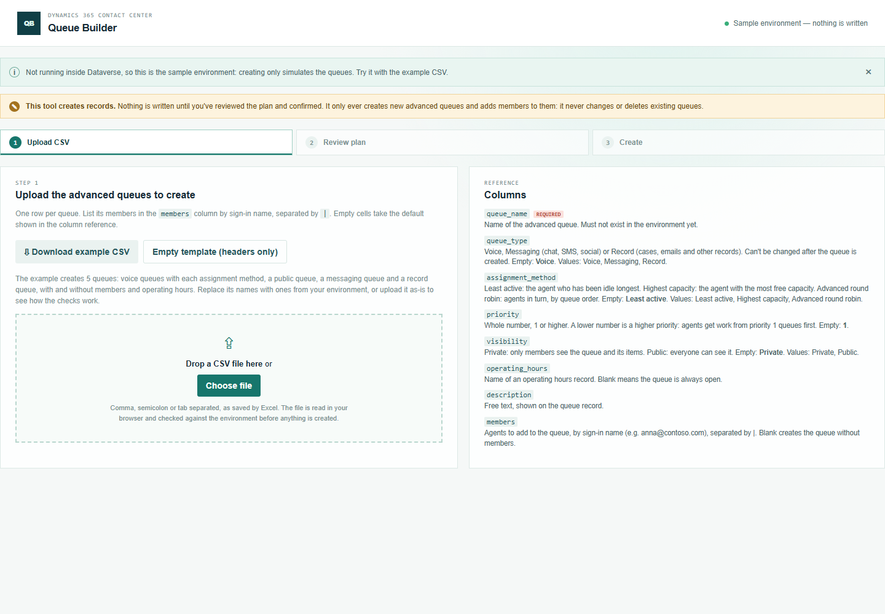
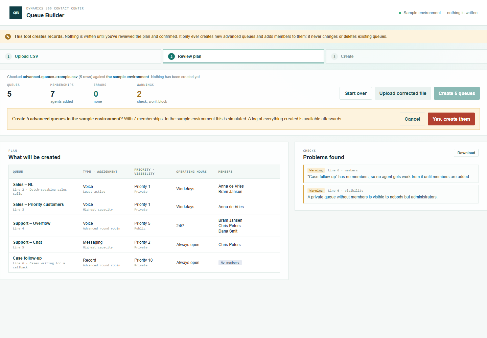
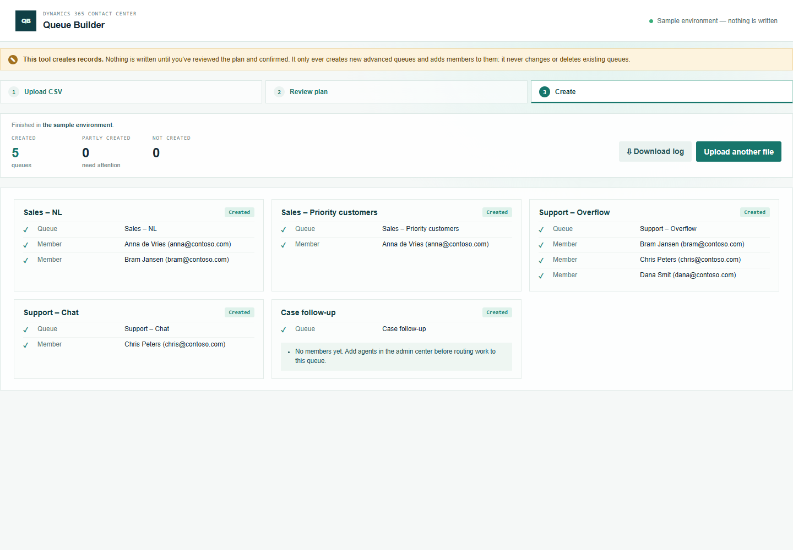

# Queue Builder — manual

Create advanced queues, with their members, from a CSV file. Nothing is written until you've reviewed the plan and confirmed it.

## 1. Prepare the CSV

Open **Queue Builder** from the Promethean CCaaS Toolbox app. The topbar shows which environment the tool will create queues in.

Click **Download example CSV** and open it in Excel. It creates 5 queues and uses every column, so it doubles as a reference. (**Empty template** gives just the column headers.) Each row is one queue:

- `queue_name` is the name of the new queue. It must not exist yet.
- `queue_type` is **Voice**, **Messaging** (chat, SMS, social) or **Record** (cases, emails and other records). It can't be changed later.
- `assignment_method` is how work is handed to agents: **Least active** (the agent idle longest), **Highest capacity** (the agent with the most free capacity) or **Advanced round robin** (agents in turn).
- `priority` is a whole number. **1 is the highest priority**: agents get work from priority 1 queues before priority 2.
- `visibility` is **Private** (only members see the queue and its items) or **Public**.
- `members` lists the agents by sign-in name, separated by `|`, for example `anna@contoso.com|bram@contoso.com`. An email address works too.

The **Columns** panel on the right lists every column with its default and allowed values.

### What happens when you leave a cell empty

You don't have to fill in every column. A column left out of the file entirely is treated as empty in every row. Only `queue_name` must be present.

**The tool uses its default.** These are the tool's defaults, applied before anything is created. They match how the admin center set up the existing advanced queues in the reference environment.

| Column | Empty means |
| --- | --- |
| `queue_type` | Voice |
| `assignment_method` | Least active |
| `priority` | 1 (the highest priority) |
| `visibility` | Private |

**Nothing is set.** You can fill it in later in the admin center.

| Column | Empty means |
| --- | --- |
| `operating_hours` | No operating hours: the queue is always open. |
| `description` | No description. |
| `members` | **No members.** No agent gets work from the queue until members are added. You'll see a warning, and for a Private queue a second one, since nobody but administrators can see it. |

**Required.** `queue_name` can't be empty. An empty name is an error.

**Not in the CSV.** Custom assignment rules and overflow aren't set by this tool. Set them in the admin center; bulk overflow settings are planned as a separate provisioning tool.

## 2. Upload and review

Drop the file on the upload area, or click **Choose file**. The tool checks every row, then looks up every name in the environment. **Nothing is created at this point.**

- The tiles count the queues and the memberships that would be created.
- **What will be created** shows each queue with its type, assignment method, priority, visibility, operating hours and members, defaults included.
- **Problems found** lists every issue with its line and column. **Errors** (red) must be fixed first. **Warnings** (amber) are worth checking, but don't block.

In this example the file has two mistakes: "high" isn't a valid priority, and one member is a disabled user. Fix the file, then click **Upload corrected file**.

## 3. Create

When there are no errors, click **Create N queues**. The confirmation names the environment and the number of queues and memberships:

Click **Yes, create them** and keep the page open until it has finished.

Each queue shows the queue and every member that was added. In a live environment, the queue name links to the queue.

- If a queue can't be created, it's marked **Not created** with the reason, and its members are skipped.
- If a member can't be added, the other members and queues still go ahead. The queue is marked **Partly created**; add the missing member in the admin center.
- The tool never deletes anything.

## 4. Download the log

**Download log** saves the run as a CSV. Every row has the environment, the user and when the run started and finished. It lists every queue and member with its status, id and time, the notes per queue, and the warnings you accepted at review.

## Running the same file again

Queue names must be new. If you upload the same file again, every queue that was created is reported as "already exists", so nothing is created twice.
