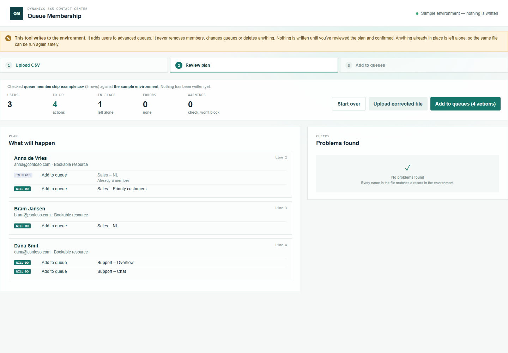

# Queue Membership

Part of the [Promethean CCaaS Toolbox](../../Readme.md). **Step 3 of onboarding agents** ([Team Builder](../team-builder/README.md) → [User Setup](../user-setup/README.md) → [Queue Membership](README.md)). It adds users who are already **bookable resources** to one or more advanced queues, in bulk from a CSV file.

See the [manual](manual.md) for a walkthrough with screenshots, and [IMPLEMENTATION_STATUS.md](IMPLEMENTATION_STATUS.md).



## The CSV

One row per user.

| Column | Empty means | Notes |
| --- | --- | --- |
| `user` | **Required** | Sign-in name or email. The user must be in the environment and **already a bookable resource** (run [User Setup](../user-setup/README.md) first). |
| `queues` | **Required** | Advanced queue names separated by `\|`. |

## Safe to run again

Queues the user is already a member of are shown as **in place** and left alone; running the same file twice changes nothing the second time. The tool never removes anyone from a queue.

### Checks

| Check | Severity |
| --- | --- |
| User not found, ambiguous, disabled or not interactive; the same user twice | Error |
| The user isn't a bookable resource yet (run User Setup), or their resource is deactivated | Error |
| Queue not found, ambiguous, not an advanced (unified routing) queue, or deactivated; no queues on the row | Error |
| The user has no capacity profile (routing can't assign them work yet) | Warning |

## What gets written

One thing: **add to queue** — Associate `queuemembership_association` (POST to the queue's `$ref`), the same write as [Queue Builder](../queue-builder/README.md). The write-scope test in `tools/shared/tests/writeScopes.test.ts` fails the build if anything else appears.

## Build, run, deploy

```powershell
npm run demo:queuemembership   # http://localhost:5443/index.html — sample environment, nothing is written
pwsh ./scripts/deploy.ps1 -Tool queuemembership -CreateIfMissing   # first time
pwsh ./scripts/deploy.ps1 -Tool queuemembership                    # afterwards
```

Web resources: `pct_/tools/queuemembership/{index.html,style.css,bundle.js}`. In the packaged solution from **1.0.0.6** (Site Map: **Provisioning → Queue Membership**). For an environment on an older solution version, add a Site Map subarea: Type Web Resource, `pct_/tools/queuemembership/index.html`.
