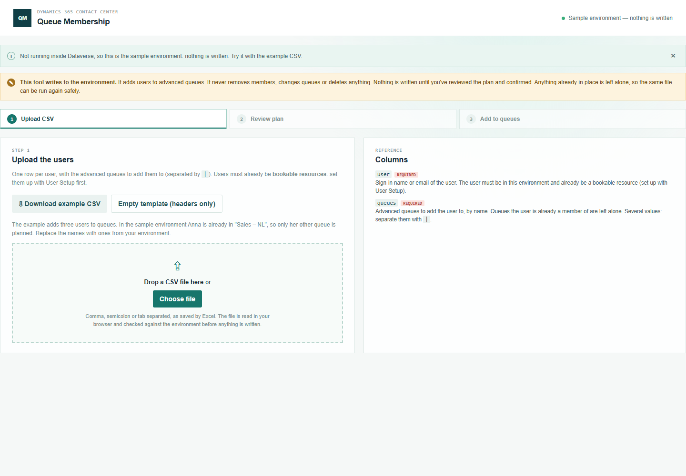
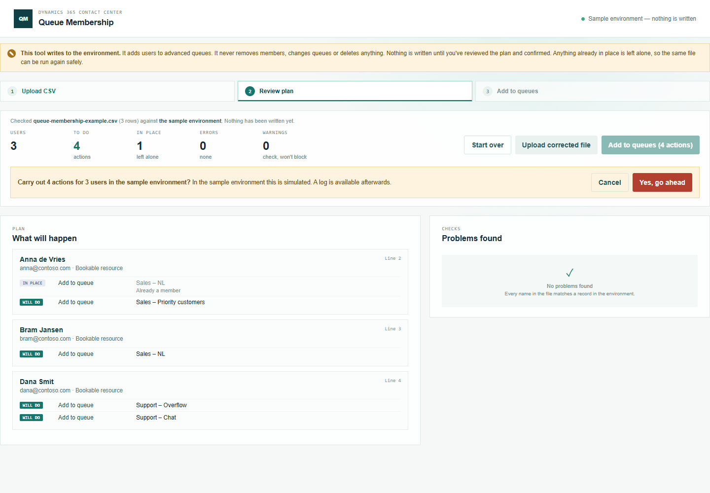
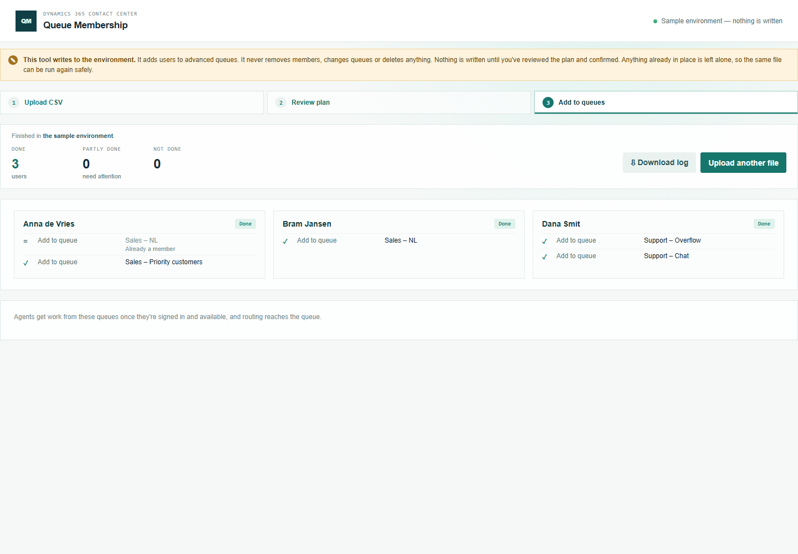

# Queue Membership — manual

Step 3 of onboarding agents: add agents to queues. The users must already be bookable resources — set them up with [User Setup](../user-setup/manual.md) first.

## 1. Prepare the CSV

Open **Queue Membership** from the Promethean CCaaS Toolbox app.

Click **Download example CSV**. Each row is one user with the queues to add them to, separated by `|`, e.g. `Sales – NL|Sales – Priority customers`.

### What happens when you leave a cell empty

| Column | Empty means |
| --- | --- |
| `user` | **Error** — every row needs a user. |
| `queues` | **Error** — every row needs at least one queue. |

There are no defaults: both columns are required.

## 2. Review

Upload the file. **Nothing is written at this point.**

For each user, **What will happen** lists one *Add to queue* per queue. **In place** means the user is already a member — in the example Anna is already in "Sales – NL". **Problems found** reports users who aren't bookable resources yet (run User Setup), queues that don't exist, aren't advanced queues, or are deactivated, and warns about users without a capacity profile.

## 3. Add to queues

Click **Add to queues**, then confirm:

Each user shows the queues they were added to. A failure on one queue doesn't stop the others. Nobody is ever removed from a queue. **Download log** saves every action with its status and time.

## Running the same file again

Existing memberships are left alone, so a second run of the same file has nothing to do.
