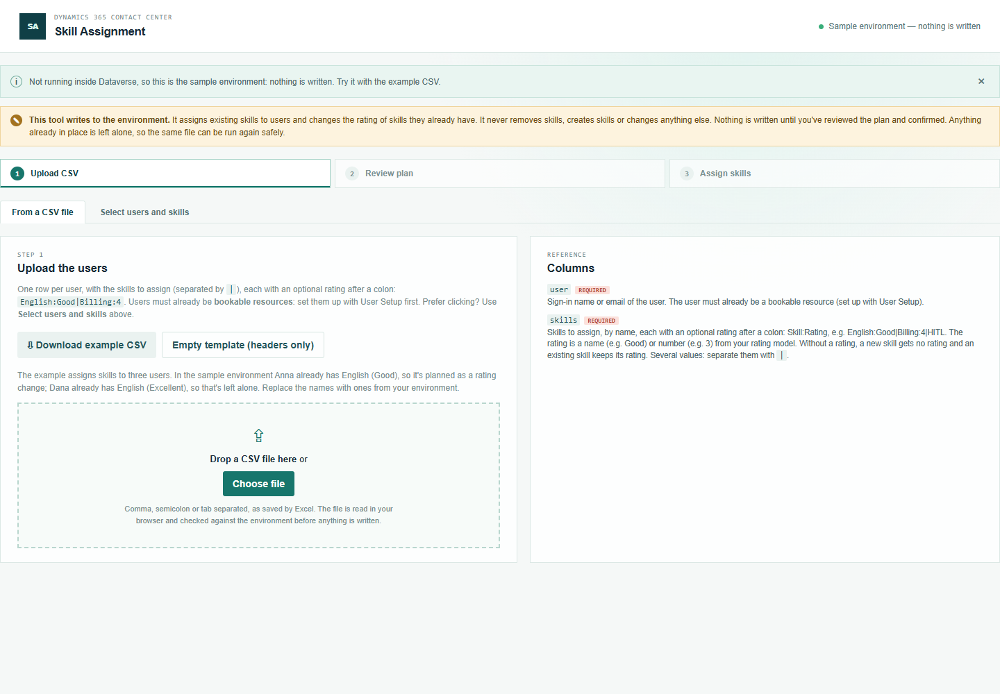
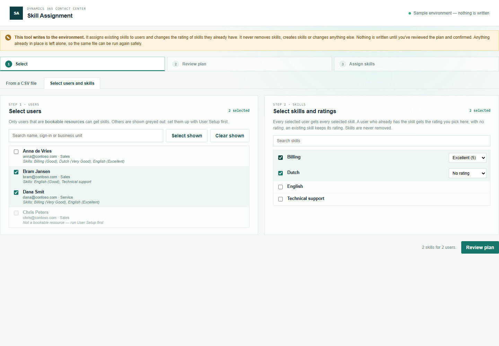
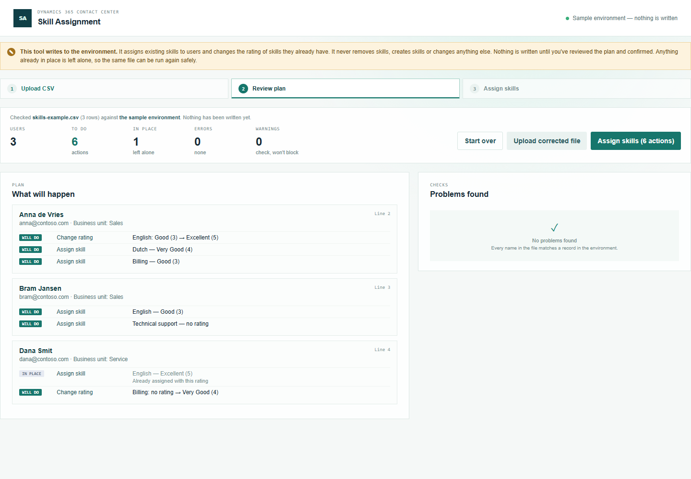
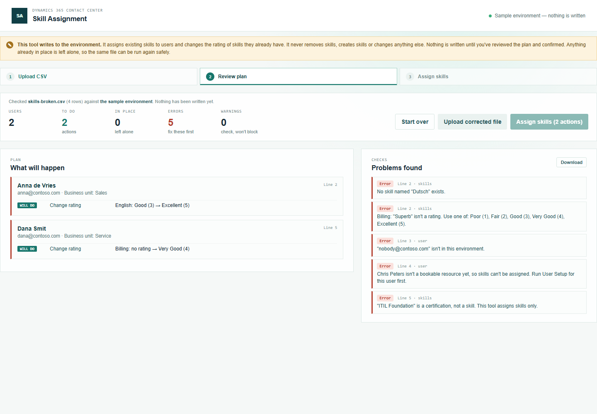
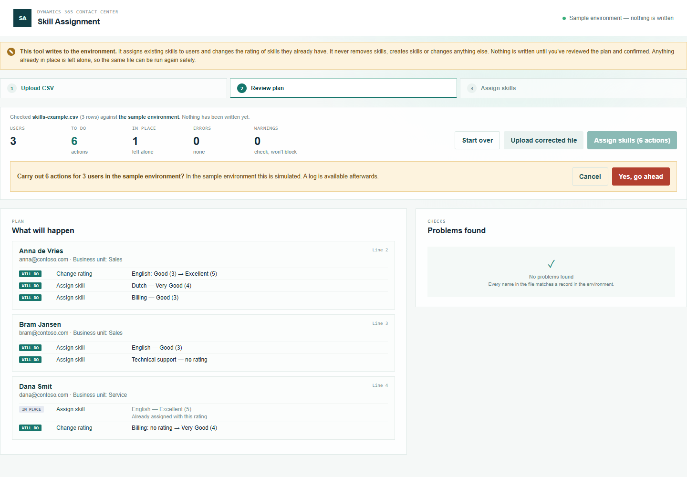
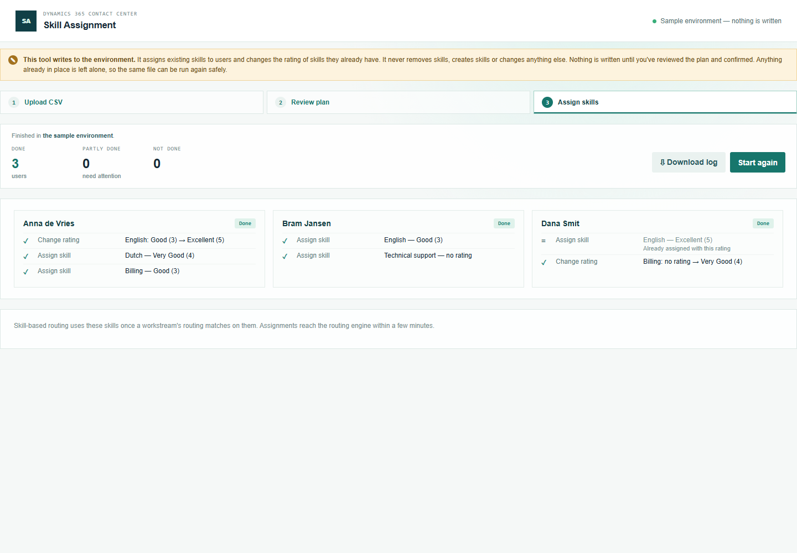

# Skill Assignment — manual

Assign existing skills to agents, with a rating, for skill-based routing. The agents must already be bookable resources — set them up with [User Setup](../user-setup/manual.md) first. The skills (characteristics of type *Skill*) and the rating model must already exist; this tool doesn't create them.

Open **Skill Assignment** from the Promethean CCaaS Toolbox app. There are two ways in; both lead to the same review and run.



## 1a. From a CSV file

Click **Download example CSV**. Each row is one user with their skills separated by `|`. Put the rating after a colon:

```
user,skills
anna@contoso.com,English:Excellent|Dutch:Very Good|Billing:3
bram@contoso.com,English:Good|Technical support
```

A rating is the name (`Good`) or the number (`3`) from your rating model; upper or lower case doesn't matter. Put all skills of one user on one row.

### What happens when you leave a cell empty

| Column | Empty means |
| --- | --- |
| `user` | **Error** — every row needs a user. |
| `skills` | **Error** — every row needs at least one skill. |

Both columns are required. Inside `skills`, the **rating is optional**:

| You write | The user doesn't have the skill | The user already has the skill |
| --- | --- | --- |
| `English` (no rating) | Assigned **without a rating** | **Left alone** — the existing rating is kept |
| `English:Good` | Assigned with **Good** | Rating set to **Good** (if it was something else) |

So leaving out the rating never clears an existing rating.

Upload the file. **Nothing is written at this point.**

## 1b. Select users and skills

Click the **Select users and skills** tab.



- **Select users** — search by name, sign-in or business unit; tick users, or use **Select shown** / **Clear shown** for everyone in the current search. Each user shows the skills they have now. Users who aren't bookable resources yet are greyed out.
- **Select skills and ratings** — tick skills; a rating list appears next to each. Leave it on **No rating** to keep the rating of users who already have the skill.

Every selected user gets every selected skill. Click **Review plan**. **Nothing is written at this point.** From the review, **Change selection** brings you back with your choices still ticked.

## 2. Review



For each user, **What will happen** lists:

- **Assign skill** — the user gets a new skill (with or without a rating).
- **Change rating** — the user has the skill with another rating; only the rating changes, e.g. `English: Good (3) → Excellent (5)`.
- **In place** — the user already has the skill with this rating, or you didn't ask for a rating.

**Problems found** lists every user, skill or rating that's wrong, each with its line and column and the name as you wrote it: users who aren't in the environment or aren't bookable resources yet, skills that don't exist, are deactivated or are certifications, and ratings that don't exist (with the ratings you can use). Nothing is skipped silently.



**While there is any error, Assign skills is disabled** — nothing runs, not even the rows that are correct. Fix the file and click **Upload corrected file** (or **Change selection**).

## 3. Assign skills

Click **Assign skills**, then confirm:





Each user shows what was done. A failure on one skill doesn't stop the others. Skills are never removed. **Download log** saves every action with its status and time.

## Running again

Skills already in place are left alone, so running the same file or selection again has nothing to do. To remove a skill or clear a rating, use the bookable resource record in Dataverse — this tool doesn't do that.
