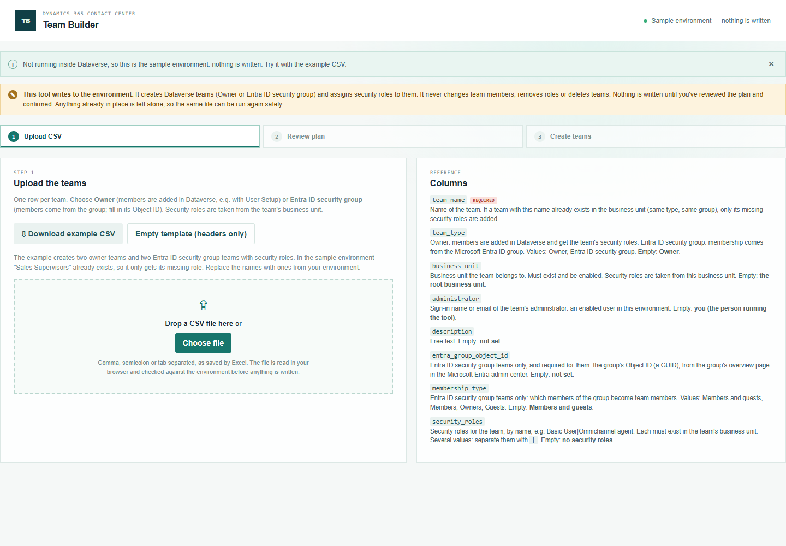
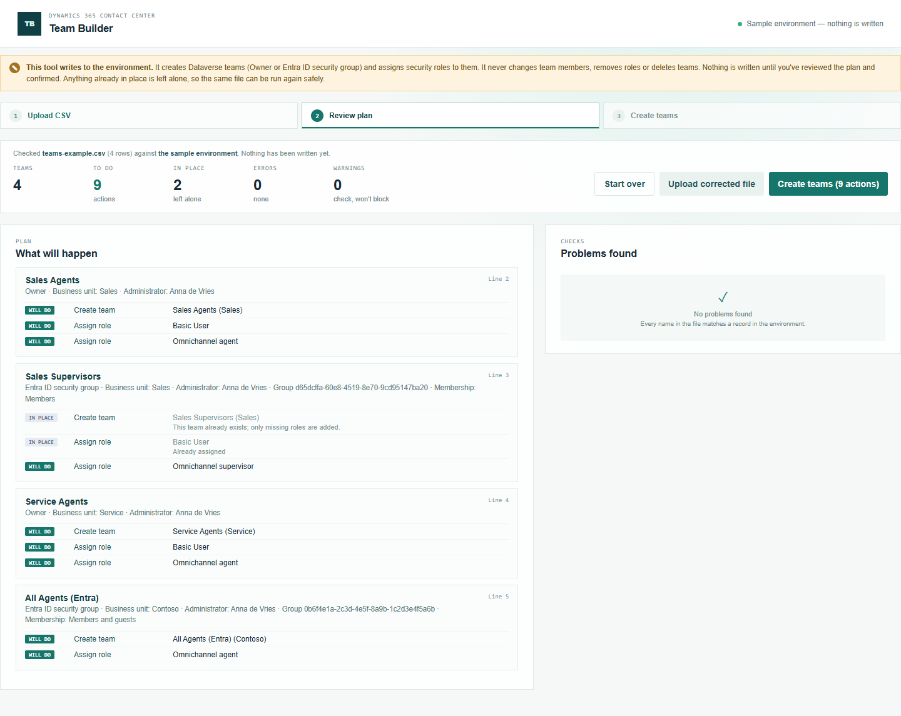
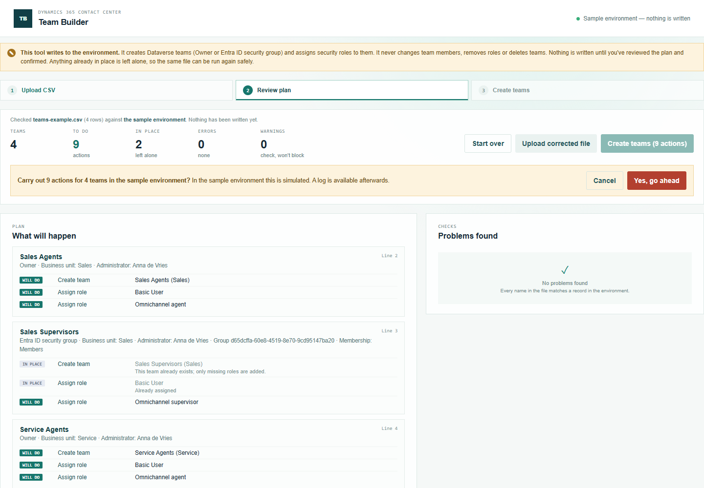
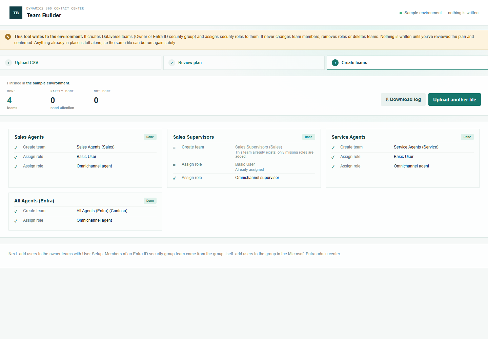

# Team Builder — manual

Step 1 of onboarding agents: create the Dataverse teams that give agents their security roles. Then add users with [User Setup](../user-setup/manual.md) and put them in queues with [Queue Membership](../queue-membership/manual.md).

## 1. Prepare the CSV

Open **Team Builder** from the Promethean CCaaS Toolbox app. The topbar shows the environment it changes.

Click **Download example CSV**. Each row is one team:

- **Owner** teams: you add members in Dataverse (with User Setup). Members get the team's security roles.
- **Entra ID security group** teams: members come from the Microsoft Entra ID group. Fill in the group's **Object ID** (on the group's overview page in the Microsoft Entra admin center) and, if needed, the **membership type**.
- `security_roles`: the roles the team gives its members, separated by `|`, e.g. `Basic User|Omnichannel agent`.

### What happens when you leave a cell empty

| Column | Empty means |
| --- | --- |
| `team_name` | **Error** — every row needs a name. |
| `team_type` | Owner |
| `business_unit` | The **root** business unit |
| `administrator` | **You**: the person running the tool |
| `description` | Not set |
| `entra_group_object_id` | **Error for an Entra ID security group team**; not used for an Owner team |
| `membership_type` | Members and guests (group teams only) |
| `security_roles` | No roles — you'll get a warning, because members get no access through the team |

A column you leave out of the file counts as empty in every row.

**Security roles are per business unit.** Every business unit has its own copy of every role. The tool always takes the role from the team's business unit, and says so if a role isn't available there.

## 2. Review

Upload the file. **Nothing is written at this point.**

For each team, **What will happen** lists the actions: *Create team* and one *Assign role* per role. **Will do** means it will be written; **In place** means it's already there and is left alone — for example "Sales Supervisors" already exists, so only its missing role is planned. **Problems found** lists errors (fix them first) and warnings.

## 3. Create

Click **Create teams**, then confirm:

Each team shows what was done. If creating a team fails, its roles are skipped; other teams go ahead. Nothing is ever deleted. **Download log** saves every action with its status, id and time.

## Running the same file again

Teams that already exist (same name, business unit and type) aren't created again — only missing roles are added. So a second run of the same file has nothing to do.
