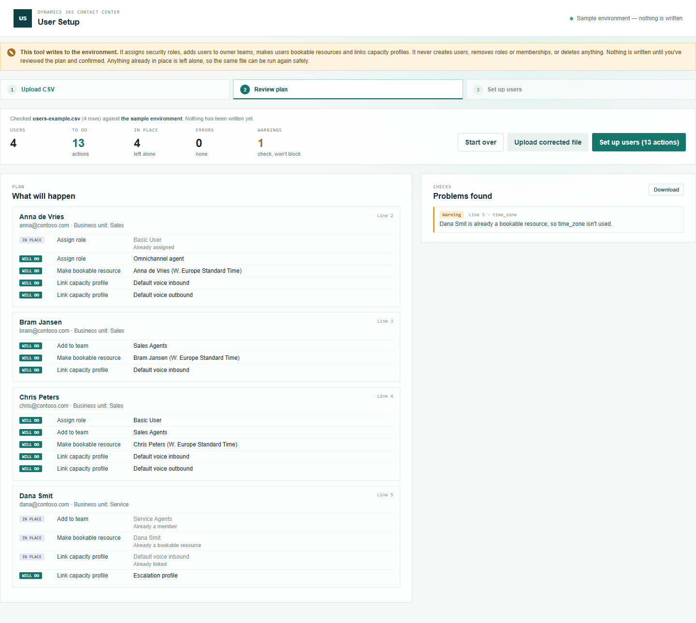

# User Setup

Part of the [Promethean CCaaS Toolbox](../../Readme.md). **Step 2 of onboarding agents** ([Team Builder](../team-builder/README.md) → [User Setup](README.md) → [Queue Membership](../queue-membership/README.md)). For users who are already in the environment, it gives them access — **directly with security roles**, **through owner teams**, or both — and makes each of them a **bookable resource with capacity profiles**, so routing can assign them work.

See the [manual](manual.md) for a walkthrough with screenshots, and [IMPLEMENTATION_STATUS.md](IMPLEMENTATION_STATUS.md) for how the schema was verified.



## Users come from Microsoft Entra ID

The tool doesn't create users. A user appears in the environment when they're **licensed** and a member of the environment's **security group** in Microsoft Entra ID — Dataverse syncs them automatically, or when they first sign in. A page inside Dataverse can't look users up in Entra ID, so a CSV row for a user who isn't synced yet is reported clearly ("isn't in this environment yet") instead of guessed at. Add them in Entra ID, wait for the sync, and run the file again.

## The CSV

One row per user.

| Column | Empty means | Notes |
| --- | --- | --- |
| `user` | **Required** | Sign-in name or email of a user who's already in the environment. |
| `security_roles` | No roles assigned directly | Role names separated by `\|`, taken from the **user's own business unit**. |
| `teams` | Not added to a team | **Owner** team names separated by `\|`. The user gets the team's roles. Entra ID group teams and access teams are refused, with what to do instead. |
| `capacity_profiles` | **Default voice inbound** and **Default voice outbound** | Names or unique names separated by `\|`, linked to the user's bookable resource. Write `none` to link none (warning). |
| `time_zone` | The **user's own time zone** (from their settings; UTC if they have none, with a warning) | Code (e.g. `110`) or name (e.g. `W. Europe Standard Time`). Only used when the bookable resource is created. |

The defaults match how the existing agents in the reference environment are set up.

## Safe to run again

Every action checks what's already there first: roles the user has, teams they're in, an existing bookable resource and its capacity profiles are shown as **in place** and left alone. Running the same file twice changes nothing the second time. The tool never removes a role, a team membership or a capacity profile.

### Checks

| Check | Severity |
| --- | --- |
| User not in the environment yet, ambiguous, disabled, or not an interactive user; the same user twice | Error |
| Role not found, or not available in the user's business unit | Error |
| Team not found, ambiguous, an **Entra ID group team** (add the user to the group in Entra ID) or an **access team** (gives no roles) | Error |
| Capacity profile not found or ambiguous; time zone not found; the user's bookable resource is deactivated | Error |
| The user has no role and gets none here (can't sign in) | Warning |
| No capacity profile (routing can't assign work); no own time zone (UTC used); `time_zone` for a user who's already a resource (not used) | Warning |

## What gets written

| Action | How |
| --- | --- |
| Assign role | Associate `systemuserroles_association` (POST to the user's `$ref`). |
| Add to team | The `AddMembersTeam` action on the owner team. |
| Make bookable resource | `createRecord` on `bookableresource`: `name` (the user's full name), `resourcetype` 3 (User), `UserId` (the user), `timezone`, `msdyn_displayonscheduleboard`. |
| Link capacity profile | `createRecord` on `msdyn_bookableresourcecapacityprofile`, named after the profile's unique name. |

It never creates or changes users, removes anything, or updates or deletes records; the write-scope test in `tools/shared/tests/writeScopes.test.ts` fails the build otherwise.

## Build, run, deploy

```powershell
npm run demo:usersetup   # http://localhost:5442/index.html — sample environment, nothing is written
pwsh ./scripts/deploy.ps1 -Tool usersetup -CreateIfMissing   # first time
pwsh ./scripts/deploy.ps1 -Tool usersetup                    # afterwards
```

Web resources: `pct_/tools/usersetup/{index.html,style.css,bundle.js}`. In the packaged solution from **1.0.0.6** (Site Map: **Security → User Setup**). For an environment on an older solution version, add a Site Map subarea: Type Web Resource, `pct_/tools/usersetup/index.html`.
