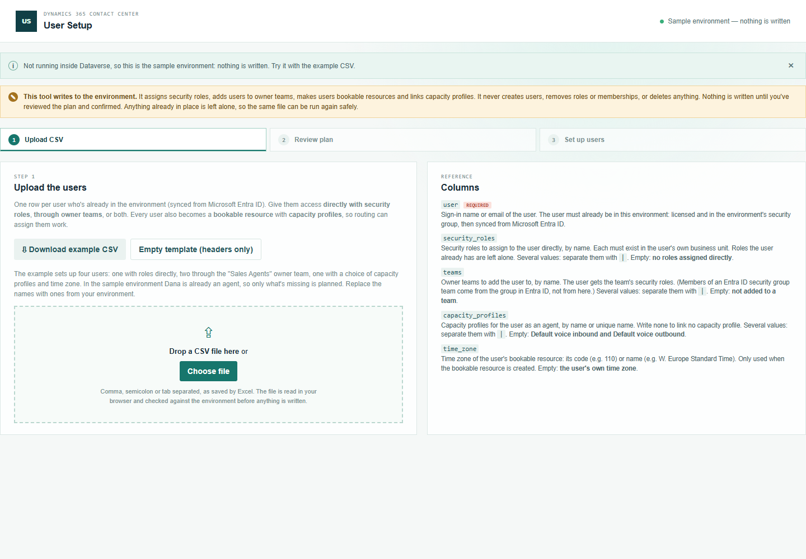
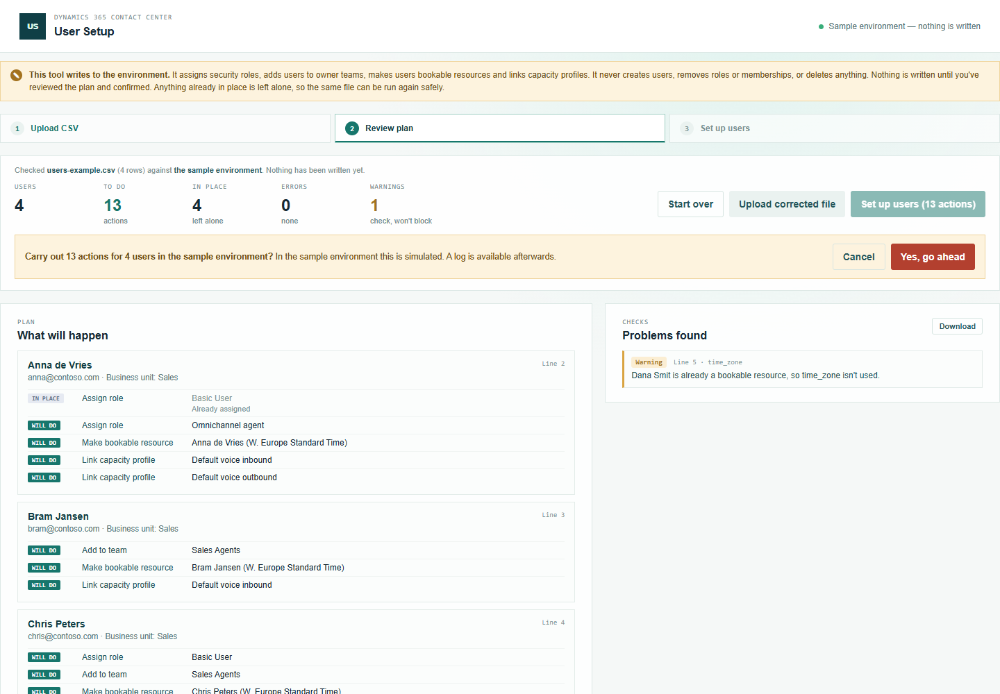
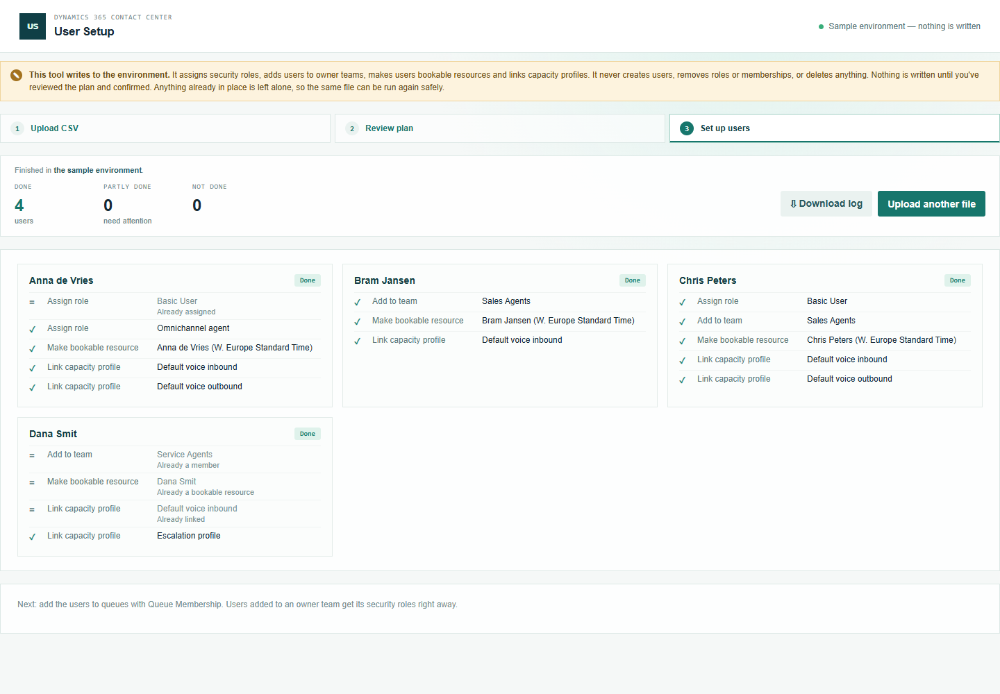

# User Setup — manual

Step 2 of onboarding agents: give users who are already in the environment their access and make them agents. Teams come first ([Team Builder](../team-builder/manual.md)); queues come after ([Queue Membership](../queue-membership/manual.md)).

## Before you start: get the users into the environment

User Setup doesn't create users. A user is in the environment when they're **licensed** and in the environment's **security group** in Microsoft Entra ID; Dataverse then syncs them (or adds them when they first sign in). If a row says a user "isn't in this environment yet", do that first and run the file again.

## 1. Prepare the CSV

Open **User Setup** from the Promethean CCaaS Toolbox app.

Click **Download example CSV**. Each row is one user. Give access in either or both ways:

- **Directly**: `security_roles`, e.g. `Basic User|Omnichannel agent`.
- **Through owner teams**: `teams`, e.g. `Sales Agents`. The user gets the team's roles.

Every user also becomes a **bookable resource** with **capacity profiles**, which routing needs to assign them work.

### What happens when you leave a cell empty

| Column | Empty means |
| --- | --- |
| `user` | **Error** — every row needs a user. |
| `security_roles` | No roles assigned directly |
| `teams` | Not added to a team |
| `capacity_profiles` | **Default voice inbound** and **Default voice outbound** (write `none` for no profiles) |
| `time_zone` | The **user's own time zone**; UTC if they have none (you'll get a warning) |

A column you leave out of the file counts as empty in every row. If a user ends up with no role at all, you'll get a warning: they can't sign in to the apps without one.

**Security roles are per business unit.** Roles are taken from the user's own business unit. **Teams**: only owner teams can be used. For an Entra ID group team, add the user to the group in Microsoft Entra ID instead — the tool tells you which.

## 2. Review

Upload the file. **Nothing is written at this point.**

For each user, **What will happen** lists the actions: *Assign role*, *Add to team*, *Make bookable resource* (with the time zone it will get) and *Link capacity profile*. **Will do** is written; **In place** is already there and left alone — in the example, Dana is already an agent, so only her extra capacity profile is planned.

## 3. Set up

Click **Set up users**, then confirm:

Each user shows what was done. If creating the bookable resource fails, its capacity profiles are skipped; roles and teams still go ahead. Nothing is ever removed. **Download log** saves every action with its status, id and time.

## Running the same file again

Everything already in place is left alone, so a second run of the same file has nothing to do — useful after a few users were "not in this environment yet": just run the file again once they are.
