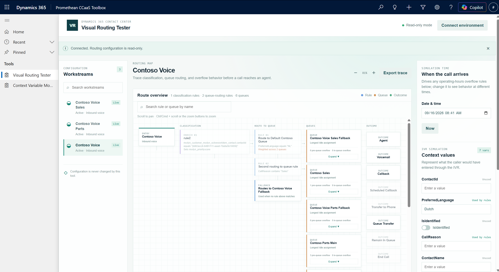

# Visual Routing Tester

Part of the [Promethean CCaaS Toolbox](../../Readme.md). For step-by-step usage instructions and screenshots, see the [manual](manual.md).



## What it does

Visual Routing Tester is a diagnostic tool for **Dynamics 365 Contact Center** (unified routing) administrators. It lets you pick an inbound voice workstream and see its entire routing configuration — work classification, route-to-queue rules, queue overflow rules, and every reachable outcome — as one interactive diagram, built directly from the live configuration in your environment.

You can then **simulate a call** by filling in context-variable values (standing in for whatever the real IVR would collect) and a simulated time, and run it against that configuration. The tool evaluates the rules locally, in the browser, and highlights exactly which rule matched, why, and where the call ends up — without placing a real call, writing to Dataverse, or affecting live routing in any way.

Typical uses:
- Understand how a workstream is configured to route calls, end to end, without tracing it manually across multiple admin screens.
- Test specific scenarios (e.g. "what happens for a Dutch-speaking caller outside business hours?") before or after a configuration change.
- Spot misconfigurations, such as a rule pointing at a queue that no longer exists, or a workstream with no matching rule and no fallback.

## Key features

- Full routing diagram: workstream → classification → route-to-queue rules (with a distinct fallback/no-match path) → every reachable queue (including queues only reachable via overflow "Queue Transfer") → all eight real overflow outcomes. Pan/zoom, search-and-highlight by name, and a click-to-inspect detail drawer on every node.
- Real operating-hours evaluation against each queue's actual calendar, driven by a simulated date/time.
- Per-queue simulated overflow inputs (wait time, queue size, operating-hours override), since a call can transfer between queues mid-simulation.
- Instant, animated, and manual step-by-step simulation modes, with a readable/exportable trace.
- Saved test scenarios (per workstream, browser-local) for regression testing routing changes over time.
- A persistent configuration-warnings panel that surfaces problems (missing queues, unparseable rules/calendars, unsupported step types) even before you run a simulation.
- A fully working offline demo mode with bundled sample data — no Dataverse connection required to try it out.

This is a **read-only** tool: it never creates, updates, or deletes any routing configuration, queue, workstream, or conversation record, and never places a real call.

## How it works

A plain HTML/CSS/React (TypeScript) app, deployed as a trio of Dataverse web resources (`index.html`, `bundle.js`, `style.css`) and hosted via a Site Map subarea in a model-driven app — not a PCF control, not a Custom Page (see the [toolbox README](../../Readme.md#architecture) for why). It reads Dataverse read-only through `Xrm.WebApi`, reusing the signed-in user's own session — no separate app registration or sign-in required.

For the full technical detail — real Dataverse schema findings, the rule-XML parser, hit-policy evaluation, operating-hours logic, and known environment quirks — see [IMPLEMENTATION_STATUS.md](IMPLEMENTATION_STATUS.md). For the original functional spec this tool was built from, see [SPEC.md](SPEC.md).

## Build, test, and run locally (no Dataverse connection needed)

```powershell
npm install
npm test
npm run build
npx serve dist/webresource/routingtester -l 5432
```

Then open `http://localhost:5432/index.html`. The bundled demo data includes a Queue Transfer example (set "Current queue size before joining" ≥ 5 on the Netherlands priority queue and run) so that path is exercisable offline.

## Deploy to a Dataverse environment

```powershell
pwsh ./scripts/deploy.ps1 -Tool routingtester
```

See the [toolbox README](../../Readme.md#deployment) for how deployment is configured (`deploy.config.json`) and what the script does.
