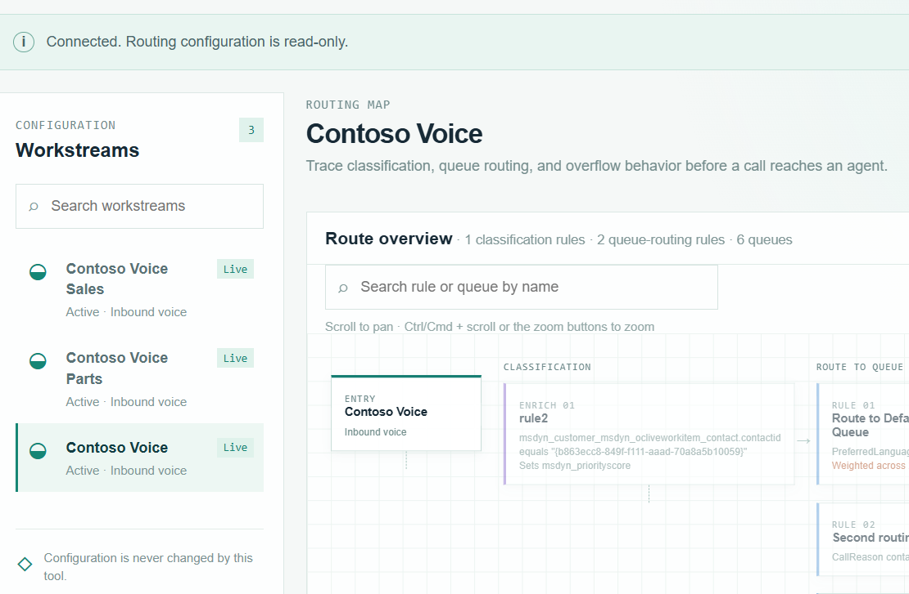
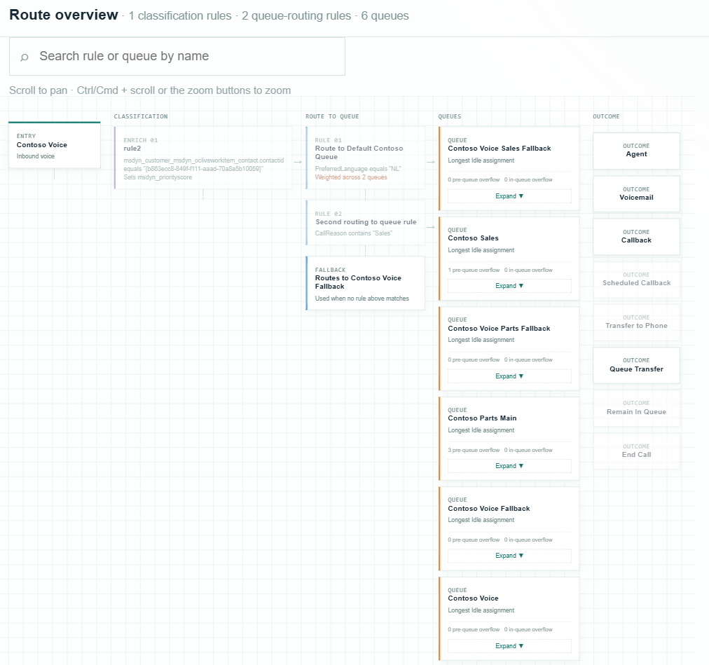
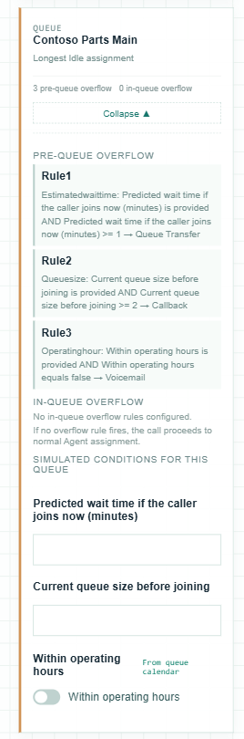
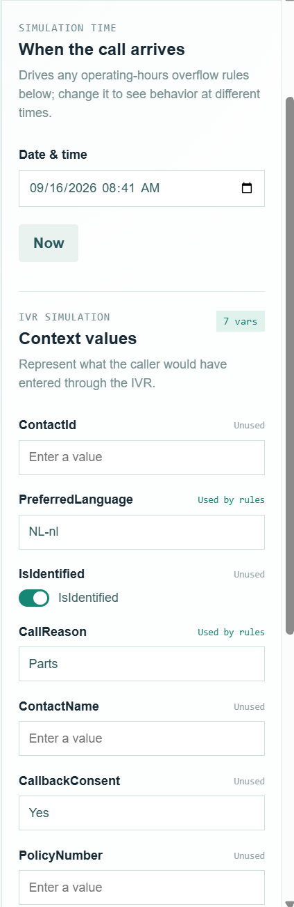
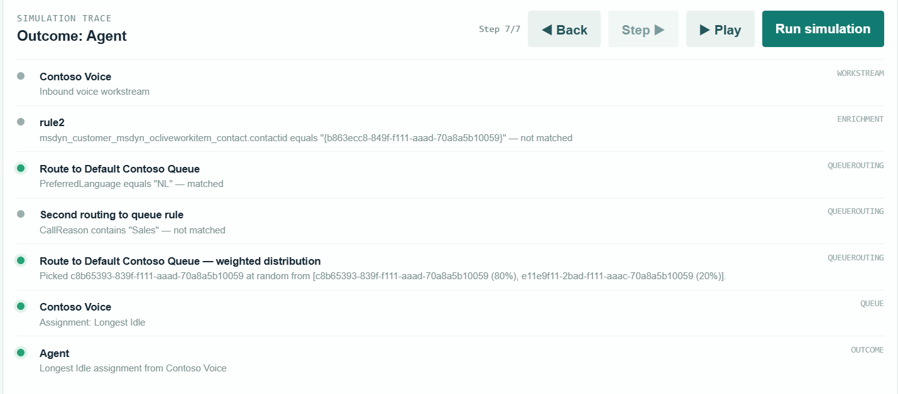
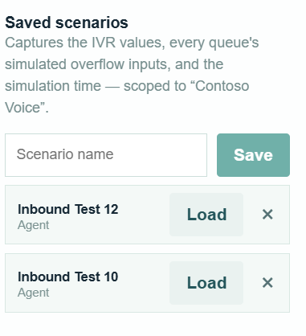

# Visual Routing Tester — User Manual

Part of the [Promethean CCaaS Toolbox](../../Readme.md). For what the tool does and how it's built, see the [README](README.md). This manual walks through actually using it.

## 1. Opening the tool

1. In your Dynamics 365 Contact Center model-driven app, open the **Visual Routing Tester** subarea from the Site Map.
2. On load, the tool automatically connects using your own signed-in session (no separate sign-in) and lists your environment's **inbound voice workstreams** in the left sidebar.
3. If it can't reach Dataverse (e.g. you're running it locally without a connection), it falls back to a **demo workstream** with sample data — a banner across the top says "Demo data is shown until a Dataverse connection is available." Everything below works the same way against demo data.

## 2. Selecting a workstream

1. Use the **Search workstreams** box at the top of the left sidebar to filter by name.
2. Click a workstream in the list to load its routing configuration. The main panel redraws the diagram for that workstream.
3. If a workstream is **inactive**, a warning banner appears under the header: "This workstream is inactive. The routing map reflects its saved configuration, not live traffic."
4. If any part of the configuration couldn't be parsed (missing queue, unparseable rule/calendar, unsupported step type), a **Configuration warnings** panel appears above the diagram, listing each issue. This is a *persistent* panel — it's populated as soon as a workstream loads, before you run any simulation.

## 3. Reading the routing diagram

The diagram lays out the full routing path left to right, in columns:

- **ENTRY** — the workstream itself.
- **CLASSIFICATION** — each enrichment/work-classification rule, in order, showing its condition summary and which context variables it sets. Disabled rules are tagged "Disabled".
- **ROUTE TO QUEUE** — each route-to-queue rule, plus a distinct **FALLBACK** node showing what happens when no rule matches (or a warning if there's no fallback).
- **QUEUES** — every reachable queue, including ones only reachable via overflow ("Queue Transfer"), showing its assignment method.
- **OUTCOME** — all real overflow/terminal outcomes reachable from any queue (e.g. voicemail, disconnect, transfer).

Use:
- **Pan/zoom** directly on the diagram canvas to navigate large routing maps.
- The **Search rule or queue by name** box (above the diagram) to highlight matching nodes.
- **Click any node** to open its detail drawer — for a queue, this includes pre-queue and in-queue overflow configuration and (once you've entered simulated conditions) the simulated values feeding it.

## 4. Simulating a call

The right-hand **inspector** panel is where you configure a simulated call:

1. **Simulation time** — set the "Date & time" field to the moment you want to simulate (drives operating-hours overflow rules), or click **Now**.
2. **Context values** — under "IVR simulation", fill in a value for each context variable the workstream's rules use. Fields used by at least one rule are marked "Used by rules"; unused ones are marked "Unused" so you know they won't affect the outcome.
3. Per-queue simulated overflow inputs (wait time, queue size, operating-hours override) appear in a queue's detail drawer once relevant — a call can transfer between queues mid-simulation, so these can matter for queues reached via overflow.
4. Click **Run simulation**.

## 5. Reading the simulation result

After running, the diagram highlights the exact path the simulated call took, and the **Simulation trace** panel (bottom of the main area) shows:

- The header changes to **"Outcome: <result>"**.
- A **step-by-step trace list** of every rule evaluated, in order, with a status (matched/skipped) and a short explanation of why.
- Any simulation-time warnings (e.g. a rule referencing a missing queue) shown inline with a ⚠ marker.

Playback controls let you replay the trace at your own pace instead of just seeing the end state:
- **◀ Back** / **Step ▶** — move through the trace one rule at a time.
- **▶ Play** — animate through the full trace automatically.
- The **Step X/Y** counter shows where you are in playback.

## 6. Saving and reusing scenarios

Scenarios (the context values + simulation time you've configured) can be saved per workstream, in your browser only — nothing is written to Dataverse:

1. Type a name into **Scenario name**.
2. Click **Save**.
3. Later, click **Load** next to a saved scenario to restore its values, or the **×** to delete it.

Use this for regression-testing a workstream: save a scenario before a configuration change, then reload it afterward to confirm the outcome is still what you expect.

## Notes

- This tool is **read-only**: it never creates, updates, or deletes routing configuration, queues, workstreams, or conversation records, and never places a real call. Everything above happens locally in your browser.
- To watch what a *real* call actually does, rather than simulate one, use [Context Variable Monitor](../context-variable-monitor/manual.md) instead.
