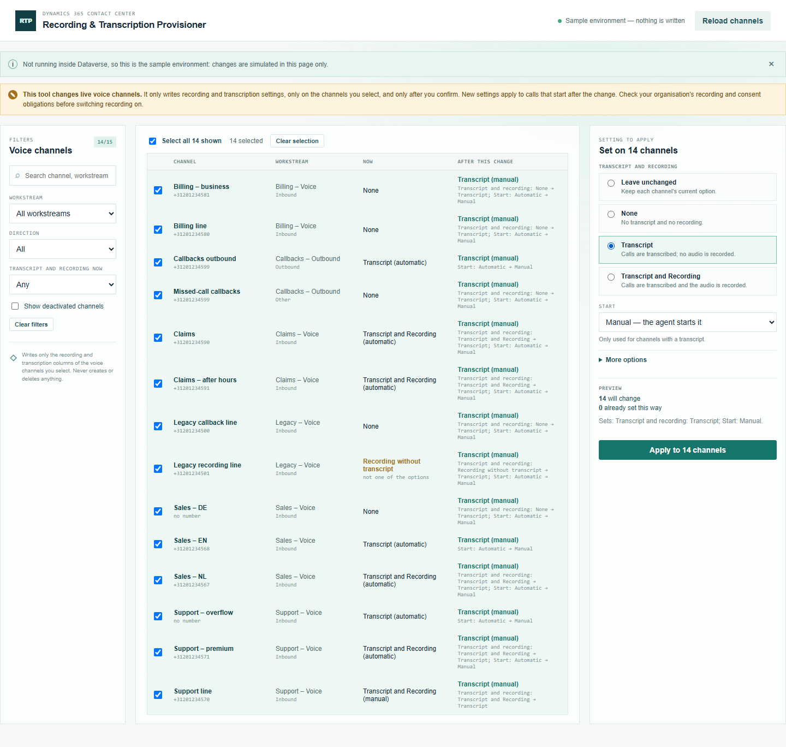
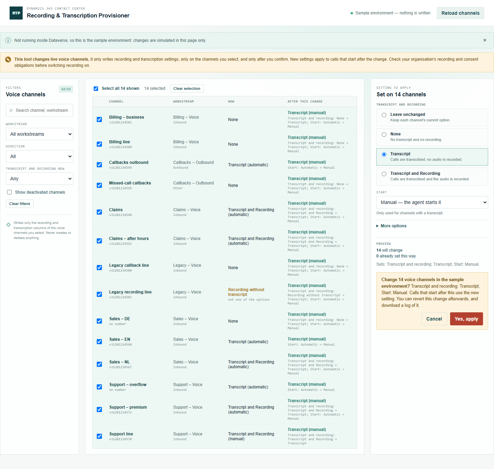
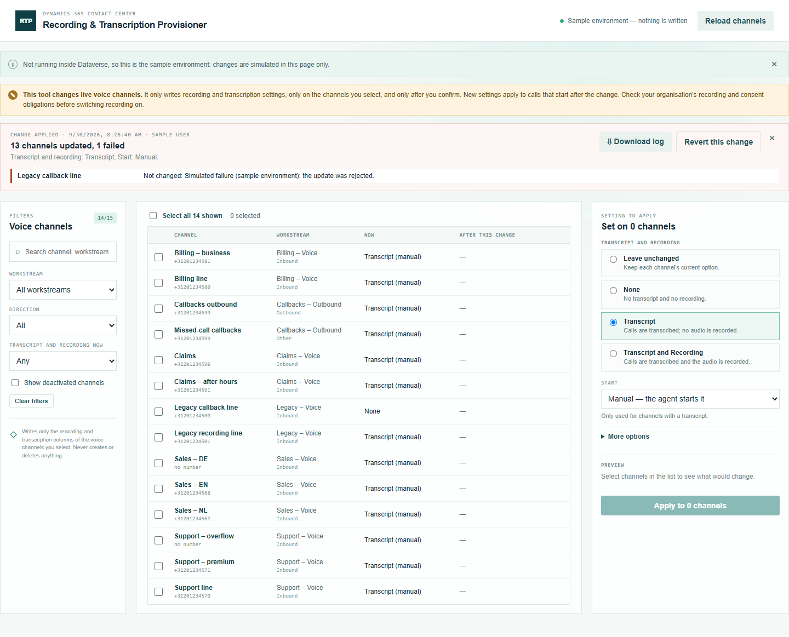
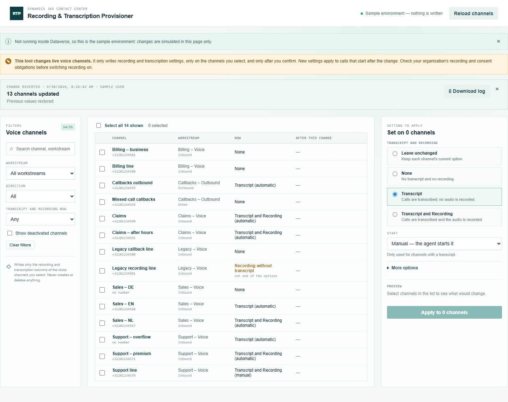

# Recording & Transcription Provisioner — manual

Set transcript and recording on many voice channels at once.

## 1. Select the channels

Open **Recording & Transcription Provisioner** from the Promethean CCaaS Toolbox app. The topbar shows which environment it changes. The list shows every active voice channel, with its workstream, number and current setting.

- Narrow the list with the filters on the left: **Workstream**, **Direction**, **Transcript and recording now** (for example, every channel with None), or the search box.
- Tick channels one by one, or use **Select all N shown**. Selections are kept when you change the filters, so you can build a selection from several views.

## 2. Choose the setting

On the right, choose one of the three options:

- **None**: no transcript and no recording.
- **Transcript**: calls are transcribed; no audio is recorded.
- **Transcript and Recording**: calls are transcribed and the audio is recorded.

**Start** sets whether it starts automatically when the call connects, or the agent starts it (**Manual**). **More options** holds the other six options, such as asking the caller for consent. Everything starts on **Leave unchanged**, so only what you pick is written.

Each row's **After this change** column shows what it would become, and each option that changes, e.g. *Transcript and recording: None → Transcript*. **No change** means the channel already has it, and it won't be touched.

A channel marked *Recording without transcript* has recording on without a transcript, which isn't one of the three options. Applying any option replaces it.

## 3. Apply

Click **Apply to N channels**. The confirmation names the environment and the change:

Click **Yes, apply**. Each channel is updated with only the options that change on it, and then read back to confirm.

The summary shows how many channels were updated, when, and by whom. Any channel that failed is listed with the reason, and it wasn't changed. A channel marked **not confirmed** saved but reads back differently; check it in the admin center.

## 4. Download the log

**Download log** saves the change as a CSV: one row per channel, with the environment, user, times, the setting before and after, each option that changed, and any error. Keep it with your change records.

## 5. Revert, if needed

**Revert this change** puts back the previous values of the options this change set, on every channel it updated. The revert has its own **Download log**.

New settings apply to calls that start after the change. Check your organisation's recording and consent obligations before switching recording on.
