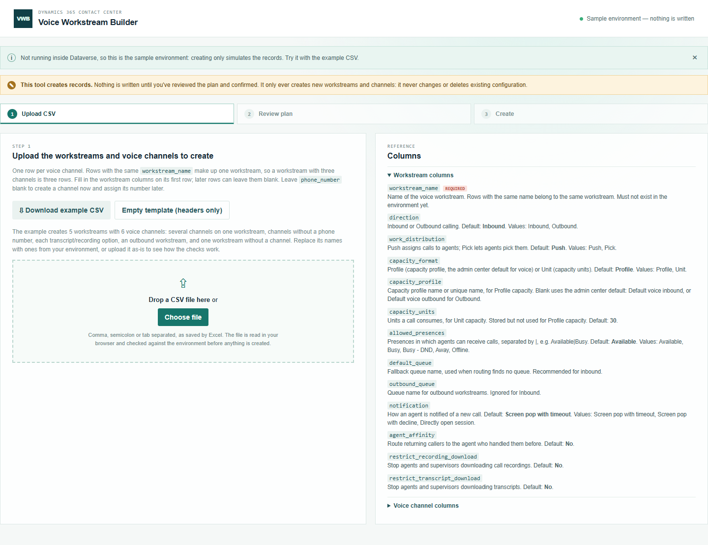
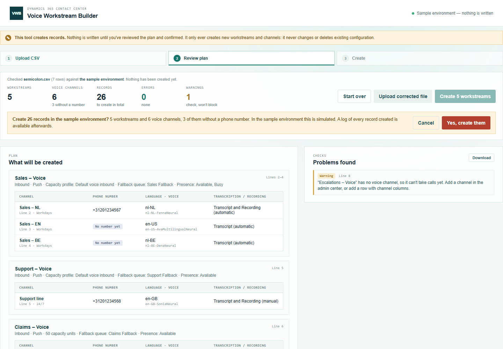
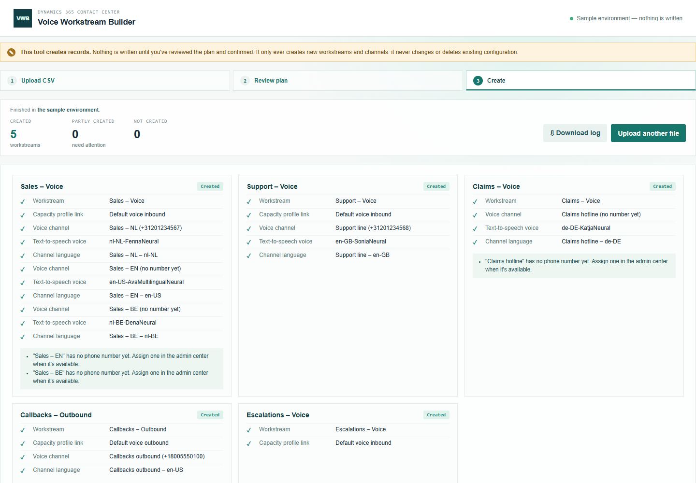

# Voice Workstream Builder — manual

Create voice workstreams and their voice channels from a CSV file. Nothing is written until you've reviewed the plan and confirmed it.

## 1. Prepare the CSV

Open **Voice Workstream Builder** from the Promethean CCaaS Toolbox app. The topbar shows which environment the tool will create records in.

Click **Download example CSV** and open it in Excel. It creates 5 workstreams with 6 voice channels and uses every column, so it doubles as a reference. (**Empty template** gives just the column headers.) Each row is one voice channel:

- Rows with the same `workstream_name` make up one workstream. In the example, *Sales – Voice* has three channels: Dutch, English and Belgian Dutch.
- Fill in the workstream columns (`direction`, `default_queue`, …) on the workstream's **first** row. You can leave them blank on its other rows.
- Leave `phone_number` blank to create the channel **without a number**. You can assign one in the admin center later.
- A row that only has workstream columns creates a workstream with no channel.
- `transcript_recording` is **None**, **Transcript**, or **Transcript and Recording**. `transcript_recording_start` says whether it starts automatically when the call connects (the default) or the agent starts it (**Manual**).
- Names (queues, capacity profiles, music, operating hours) must match records that already exist. The phone number must already have been acquired or imported. The language is a locale code such as `nl-NL`.

The **Columns** panel on the right lists every column with its default and allowed values.

Save the file as CSV. Comma, semicolon and tab separated files all work.

### What happens when you leave a cell empty

You don't have to fill in every column. A column you leave out of the file entirely is treated the same as an empty cell in every row. Only `workstream_name` must be present.

An empty cell has one of four effects, depending on the column.

**1. The tool uses its default.** These defaults are the tool's own, applied before anything is created, not something Dataverse fills in later. They were copied from the voice workstreams and channels the admin center created in the reference environment, so in most cases the result is the same as setting it up in the admin center. The two exceptions are in bold.

| Column | Empty means | Same as the admin center? |
| --- | --- | --- |
| `direction` | Inbound | – |
| `work_distribution` | Push | Yes |
| `capacity_format` | Profile | Yes |
| `capacity_profile` | Default voice inbound (Default voice outbound for an outbound workstream) | Yes |
| `capacity_units` | 30 | Yes |
| `allowed_presences` | Available | Yes |
| `notification` | Screen pop with timeout | Yes |
| `agent_affinity` | No | Yes |
| `restrict_recording_download`, `restrict_transcript_download` | No | Yes |
| `voice_speed`, `voice_pitch` | 0 (the voice's normal speed and pitch) | Yes |
| `transcript_recording` | **None: no transcript and no recording** | **Not necessarily. Check this one:** fill in Transcript, or Transcript and Recording, if the channel needs it. |
| `transcript_recording_start` | Automatic | Yes |
| `agent_transcription_controls`, `agent_recording_controls` | Yes | Yes |
| `request_recording_consent`, `stop_recording_on_hold`, `play_recording_notifications`, `show_transcript_by_default` | No | Yes |
| `pstn_transfer_controls`, `teams_transfer_controls` | Yes | Yes |

**2. Nothing is set.** The field stays empty in Dataverse. You can fill it in later in the admin center.

| Column | Empty means |
| --- | --- |
| `default_queue` | No fallback queue. Calls that match no routing rule have nowhere to go, so an inbound workstream without one gets a warning. |
| `outbound_queue` | No outbound queue. |
| `phone_number` | The channel is created **without a phone number**. Assign one in the admin center when it's available. |
| `operating_hours` | No operating hours: the channel is always open. |
| `tts_voice` | No text-to-speech voice, so automated prompts have no voice. An inbound channel without one gets a warning. |
| `voice_style` | The voice's normal style. |
| `hold_music`, `wait_music` | **No music set.** The admin center sets "Transform" by default, so fill these in if you want the same result. |

**3. The cell is required.** An empty cell is an error, and nothing can be created until it's fixed.

| Column | Required when |
| --- | --- |
| `workstream_name` | Always, on every row. |
| `channel_name`, `language` | On every row that describes a voice channel, i.e. has anything filled in among the channel columns. To create a workstream without a channel, leave **all** channel columns on that row empty. |

**4. The value comes from the workstream's first row.** A workstream with several channels has several rows. Its workstream columns (`direction` to `restrict_transcript_download`) only need to be filled in on its **first** row. An empty workstream cell on a later row takes the first row's value, **not** the default. If you do fill one in on a later row, it must match the first row, otherwise it's an error.

For example, if the first *Sales – Voice* row says `direction` Outbound and the second leaves it empty, both belong to the same Outbound workstream.

**Always set by the tool, not in the CSV.** Some values aren't columns at all. They're always written the way the admin center writes them: a voice workstream in Simplified mode, auto-close after inactivity 5, and the transfer settings "stop transcription and recording after transfer" and "use bridge transfer" switched off. The platform fills in the notification and session templates itself.

**Check before you create.** The Review step shows the main values that will actually be used, defaults included: per workstream the direction, work distribution, capacity, queues and presences, and per channel the number (or "No number yet"), language, voice and transcript/recording. It also warns about the empty cells that matter, such as no fallback queue or no voice. Nothing is created until you confirm.

## 2. Upload and review

Drop the file on the upload area, or click **Choose file**. The tool checks every row, then looks up every name in the environment. **Nothing is created at this point.**

- The tiles count what would be created, and how many channels have no number.
- **What will be created** shows each workstream with its channels, numbers, languages, voices and recording settings.
- **Problems found** lists every issue with its line and column. **Errors** (red) must be fixed before you can create anything. **Warnings** (amber) are worth checking, but don't block.

In this example the file has two mistakes: the queue "Support Fallbak" doesn't exist, and "Transcription" isn't one of the three options. The workstreams are marked and **Create** is disabled. Fix the file, then click **Upload corrected file**. **Download** saves the problem list as a CSV, for fixing the file offline.

## 3. Create

When there are no errors, click **Create N workstreams**. The confirmation names the environment and the number of records:

Click **Yes, create them** and keep the page open until it has finished.

Each workstream shows every record that was created: the workstream, its capacity profile link, and per channel the channel, its text-to-speech voice and its language. In a live environment each name links to the record. The notes under each workstream say what's left to do, such as channels that still need a number.

If a record fails, that workstream stops (**Partly created**) and its remaining records are marked as skipped. The other workstreams still go ahead. The records that were created do exist: finish the workstream in the admin center, or delete them and run that row again. The tool never deletes anything itself.

## 4. Download the log

**Download log** saves the run as a CSV. Every row has the environment, the user, and when the run started and finished. It lists every record with its type, name, status, **id** and time, the notes per workstream, and the warnings you accepted at review. Keep it with your change records. The ids are what you need to find or remove exactly what this run created.

## Running the same file again

Workstream names must be new. If you upload the same file again, every workstream that was created is reported as "already exists", so nothing is created twice.
